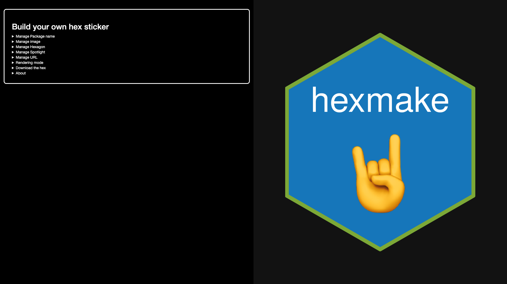
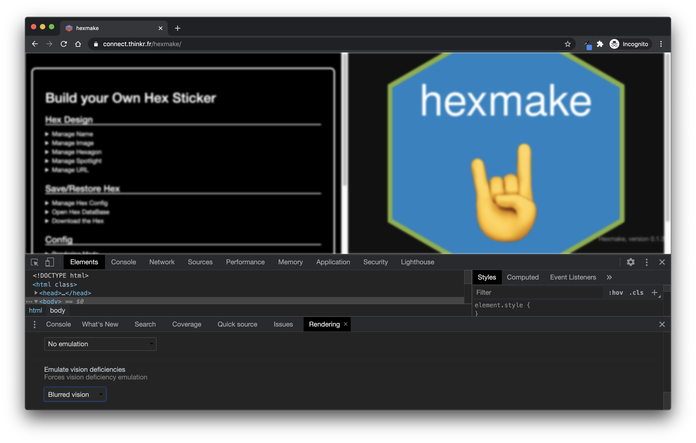
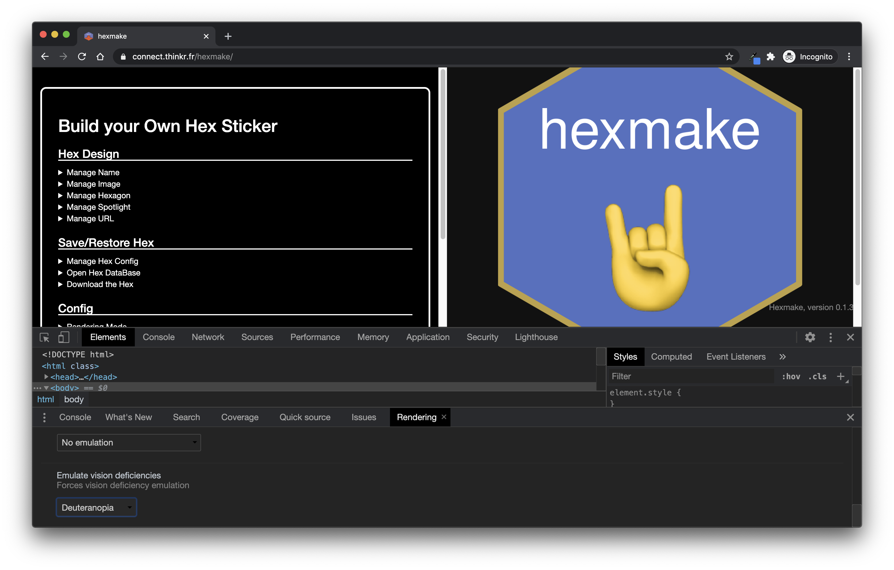

# (PART) Step 1: Design {.unnumbered}

# UX Matters {#ux-matters}

Let's state the truth: no matter how complex and innovative your back-end is, your application is bad if your user experience (UX) is bad.
That's the hard truth. 
We have a natural tendency, as R-coders, to be focused on the back-end, i.e. the server part of the application, which is perfectly normal—chances are you did not come to R to design front-ends.[^ux-matters-2]

[^ux-matters-2]: The front-end is the visual part of your application - the one your user interacts with - as opposed to the back-end, which is what is installed on the server, the part the end user does not see.
    In `{shiny}`, front-end corresponds to the UI, while back-end, to the server.

However, **if people cannot understand how to use your application, or if your application front-end does not work at all, your application is not successful no matter how innovative and incredible the computation algorithms in the back-end are**.

As you are building a complex, production-grade `{shiny}` application, do not underestimate the necessity for a successful front-end - it is, after all, the first thing (and probably the only thing) that the end users of your web application will see.
However, our natural back-end/server logic as R developers can play against us in the long run - **by neglecting the UI and the UX, you will make your application less likely to be adopted among your users, which is a good way to fail your application project**.

## Simplicity is gold

> Simplify, then add lightness.
> 
> _Colin Chapman CBE, Founder of Lotus Cars_ (<https://www.lotuscars.com/lotus-philosophy/>)

Aiming for simplicity is a hard thing, but some rules will help you build a better UX, paving the way for a successful application.

There are mainly two contexts where you will be building a web app with R: for professional use (*i.e.,* people will rely on the app to do their job), or for fun (*i.e.,* people will just use the app as a distraction).

But both cases have something in common: people will want the app to be usable, **easily** usable.

If people use your app in a professional context, they do not want to fight with your interface, read complex manuals, or lose time understanding what they are supposed to do and how they are supposed to use your application, at least when it comes to the core usage of the application.
This core usage needs to be "self-explanatory", in the sense that, **if possible, the main usage of the application does not require reading the manual**; On the other hand, more advanced/rarely used features will need more detailed documentation.

In other words, they want an efficient tool, something that - beyond being accurate - is easy to grasp.
In a professional context, when it comes to "business applications", remember that the quicker you understand the interface, the better the user experience.
Think about all the professional applications and software that you have been ranting about during your professional life, all these cranky user interfaces you did not understand and/or need to relearn every time you use them.
You do not want your app to be one of these applications.

On the other hand, if users open your app for fun, they are not going to fight against your application; they are just going to give up if the app is too complex to use.
Even a game has to appear easy to use when the users open it.

In this section, we will review two general principles: the "don't make me think" principle, which states that **interfaces should be as self-explanatory as possible**, and the "rule of least surprise", which states that elements should behave the way they are commonly expected to behave.
These two rules aim at solving one issue: the bigger the cognitive load of your app, the harder it will be for the end user to use it on a daily basis.

### How we read the web: Scanning content

One big lie we tell ourselves as developers is that the end user will use the app the way we designed it to be used (though to be honest, this is not true for any software).
We love to think that when faced with our app, the users will carefully read the instructions and make a rational decision based on careful examination of the inputs before doing what we expect them to do.
But the harsh truth is, that it is not what happens.

First of all, users rarely carefully read all the instructions: they **scan** and perform the first action that more or less matches what they need to do, i.e., they **satisfice** (a portmanteau of satisfy and suffice); a process shown in Figure \@ref(fig:06-ux-matters-1).
Navigating the web, users try to optimize their decision, not by making the decision that would be "optimal", but by doing the first action that is sufficiently satisfactory in relevance.
They behave like that for a lot of reasons, but notably because they want to be as quick as possible on the web, and because the cost of being wrong is very low most of the time - even if you make the wrong decision on a website, chances are that you are just a "return" or "cancel" button away from canceling your last action.

(ref:scanningcap) How we design a web page versus how a user will really scan it.
From [@stevekrug2014].

```{r 06-ux-matters-1, echo=FALSE, fig.cap="(ref:scanningcap)", out.width="100%"}
knitr::include_graphics("img/scanning.png")
```

For example, let's have a look at the user interface of `{hexmake}` [@R-hexmake], a `{shiny}` app for building hex stickers, available at <https://connect.thinkr.fr/hexmake/> (see Figure \@ref(fig:00-app-presentation-3) for a screenshot of this application).

(ref:hexmakecap) Snapshot of the `{hexmake}` `{shiny}` application on <https://connect.thinkr.fr/hexmake/>.

```{r 06-ux-matters-2, echo=FALSE, fig.cap="(ref:hexmakecap)", out.width="100%"}

```

What will be your reading pattern for this application?
What is the first thing you will do when using this app?

There is an inherent logic in the application: each sub-menu is designed to handle one specific part of your sticker.
The second menu is the one used to download the sticker, and the last menu is the one used to open the "how to" of the app.
When opening this app, will your first move be to open the "How to"?
Will you open all the sub-menus and select the most "logical" one to start with?
Chances are that by reading this line, you think you will do that.
But in reality, we behave less rationally than we'd like to think.
What we do most of the time is click on the first thing that matches what we are here to do.
For example, most of the time we will first change the package name or upload an image before even opening the "about" section of this app.

Once users have scanned the page, they perform the first action that seems reasonable, or as coined in "Rational Choice and the Structure of the Environment" by Herbert A. Simon, "**organisms adapt well enough to 'satisfice'; they do not, in general, optimize."**.
In other words, **"As soon as we find a link that seems like it might lead to what we're looking for, there's a very good chance that we'll click it"** (_Don't Make Me Think_, [@stevekrug2014]).

What that also means is that user might perform what you'd expect to be "irrational" choices.
As they are scanning your application, they might do something unexpected, or use a part of your app in a way that you would not expect it to be used.
For example, if you are creating an app that is designed to take input data that has to be filled in following a specific form, you **need** to check that this requirement is fulfilled, or you will end up debugging errors on uncommon entries.

This is a pretty common thing about apps and about software in general: you have to expect users to use your product in ways you would not have expected, in ways that might seem absurd to you.
This is called "defensive programming" - you prevent the application from being used in an unexpected way, and instead of relying on the end user to be rational with their choice, we "defend" our function from unexpected inputs.

For example, consider this small app:

```{r 06-ux-matters-3, eval = FALSE}
library(shiny)
ui <- function(){
  tagList(
    # Designing an interface that lets the 
    # user select a species from iris, 
    # then display a plot() of this dataset
    selectInput(
      "species", 
      "Choose one or more species",
      choices = unique(iris$Species),
      multiple = TRUE, 
      selected = unique(iris$Species)[1]
    ), 
    plotOutput("plot")
  )
}

server <- function(
  input, 
  output, 
  session
){
  # Taking the species as input, and returning the plot 
  # of the filtered dataset
  output$plot <- renderPlot({
    plot(
      iris[ iris$Species %in% input$species, ]
    )
  })
}

shinyApp(ui, server)
```

What is wrong with this app?
Probably nothing from a developer point of view - there is a label stating that one should select one or more elements from the drop-down list, and then something is plotted below.
Pretty standard.
But what happens if the drop-down is empty?
Our first thought would be that this would never happen, as it is explicitly specified that there should be one or more elements selected.
In fact, chances are that even with this label, users will eventually end up with an empty `selectInput()`, leading to the printing of a red error where the plot should be.
We are lucky here, as the error only prevents the plot from being displayed; other errors could make the application crash.

What should we do?
**Adopt a defensive programming mindset**.
Every time you create interactive elements, inputs and outputs, or things the user might interact with, ask yourself: "What if that [crazy thing] happens? How do I handle the case where the minimal viable requirements for my app are not met?"
And in fact, you should not be focusing on that only for the user side - the back-end should also be examined for potential unexpected behaviors.
For example, if your `{shiny}` app relies on a database connection, you should gracefully check that the connection is possible, and if it is not, send a message to your user that the database is not reachable, and that they should either restart the app or come back in a few minutes.

In fact, this is a crucial thing when it comes to making your app successful: **you should always fail gracefully and informatively**.
That means that even when your R code fails, the whole app should not fail.
If the R code fails for some reason, the user should either get nothing back or an informative bug message, not be faced with a grayish version of the application.[^ux-matters-3]
Note that using external widgets, like the one from the `{DT}` package (or any other that binds to an external JavaScript library), can make this principle harder to apply: as you have less control over what is happening when using this widget, gracefully handling errors can be tricky.
Indeed, `{DT}` sometimes returns errors that originates from the user's browser, so that has nothing to do with R.
In that case, it might be hard to catch this error and gracefully manage it.
The only upside of this error is that it does not crash the whole application.

[^ux-matters-3]: If you want something different from this grayish screen when `{shiny}` fails, you can have a look at the `{sever}` package [@R-sever], which allows to implement custom disconnected screen and error messages.

Because of the way `{shiny}` is designed, a lot of R errors will make the `{shiny}` app fail completely.
If you have not thought about this upfront, that means that a user might use the app for 10 minutes, do a series of specifications, enter parameters and data, only for the app to completely crash at some point.
The user has to then restart from scratch, because there is no native way - from there - to restart from where the app has crashed.
This is a very important thing to keep in mind when building `{shiny}` apps: **once the app has failed, there is no easy way to natively get it back to the moment just before it crashed**, meaning that your users might lose a significant amount of the time they have spent configuring the app.

One good practice is to try, as much as possible, to **wrap all server calls in some form of try-catch** pattern.
That way, you can, for example, send a notification to the user if the process fails, either using a `{shiny}` [@R-shiny] notification function, an external package like `{shinyalert}` [@R-shinyalert], or a custom JavaScript alert like [notify.js](https://github.com/ColinFay/notifyjsexample).
Here is a pseudo-code pattern for this using the `{attempt}` [@R-attempt] package:

```{r 06-ux-matters-4, eval = FALSE}
library(shiny)
ui <- function(){
  # Here, we would define the interface
  tagList(
    # [...]
  )
}

server <- function(
  input, 
  output, 
  session
){
  # We are attempting to connect to the database, 
  # using a `connect_db()` connection
  conn <- attempt::attempt({
    connect_db()
  })
  # if ever this connection failed, we notify the user 
  # about this failed connection, so that they can know
  # what has gone wrong
  if (attempt::is_try_error(conn)){
    # Notify the user
    send_notification("Could not connect")
  } else {
    # Continue computing if the connection was successful
    continue_computing()
  }
}

shinyApp(ui, server)
```

### Building a self-evident app (or at least self-explanatory)

One of the goals of a usable app is to make it self-evident, and fall back to a self-explanatory app if the first option is too complex a goal.
What is the difference between the two?

-   self-evident: "Not needing to be demonstrated or explained; obvious." [lexico.com](https://www.lexico.com/en/definition/self_evident)

-   self-explanatory: "Easily understood; not needing explanation." <https://www.lexico.com/en/definition/self_explanatory>

The first is that the app is designed in such a way that there is no learning curve to using it.
A self-explanatory app has a small learning curve, but it is designed in a way that will make the user understand it in a matter of seconds.

Let's, for example, get back to our `{tidytuesday201942}` [@R-tidytuesday201942] application available at [connect.thinkr.fr/tidytuesday201942](https://connect.thinkr.fr/tidytuesday201942/).
By itself, this application is not self-evident: you need to have a certain amount of of background knowledge before understanding what this application was designed for.
For example, you might need to have a vague sense of what `tidytuesday` is.
If you do not, you will have to read the home text, which will help you understand what this is.
Then, if we have a look at the menu elements, we see that these are a series of functions from `{ggplot2}` [@R-ggplot2]: without any background about the package, you might find it difficult to understand what this app actually does.

Yet, if you want to understand what this app is designed for, you will find enough information either on the home page or in the About section, with external links if needed.
And of course, when building apps, context matters.
The `{tidytuesday201942}` app is one that has been developed in the context of `tidytuesday`, an online weekly event for learning data analysis, mainly through the use of `{tidyverse}` packages.
There is a good chance visitors of the app will already know what `{ggplot2}` is when visiting the app.

#### A. About the "Rule of Least Surprise" {.unnumbered}

This rule is also known as "Principle of Least Astonishment."

> Rule of Least Surprise: In interface design, always do the least surprising thing.
> 
> _The Art of UNIX Programming_ [@ericraymond2003]

When we are browsing the web, **we have a series of pre-conceptions about what things are and what they do**.
For example, we expect an underline text to be clickable, so there is a good chance that if you use underlined text in your app, the user will try to click on it.
Usually, the link is also colored differently from the rest of the text.
The same goes for the pointer of the mouse, which usually switches from an arrow to a small hand with a finger up.
A lot of other conventions exist on the web, and you should endeavor to follow them: a clickable link should have at least one of the properties we just described—and if it is neither underlined nor colored and does not change the pointer when it is hovered, chances are that the user will not click on it.

Just imagine for a second if our "Download" button in the `{tidytuesday201942}` app did not actually download the graph you had generated.
Even more, imagine if this button did not download the graph but something else.
How would you feel about this experience?

And it is not just about links: almost every visual element on a web page is surrounded by conventions.
Buttons should have borders.
Links should appear clickable.
Bigger texts are headers, the bigger the more important.
Elements that are "visually nested" are related.

Of course, this is not an absolute rule, and there is always room for creativity when it comes to design, but you should keep in mind that too much surprise can lead to users being lost when it comes to understanding how to use the application.

Weirdly enough, that is an easy thing to spot when we arrive on a web page or an app: it can either feel "natural", or you can immediately see that something is off.
The hard thing is that it is something you spot when you are a new-comer: developing the app makes us so familiar with the app that we might miss when something is not used the way it is conventionally used.[^ux-matters-4]

[^ux-matters-4]: For a good summary of these, see "The cranky user: The Principle of Least Astonishmen" <https://www.ibm.com/developerworks/web/library/us-cranky10/us-cranky10-pdf.pdf>

Let's exemplify this with the "Render" button from the [`{tidytuesday201942}`](https://connect.thinkr.fr/tidytuesday201942/) application.
This app is built on top of Bootstrap 4, which has no CSS class for a `{shiny}` action button.[^ux-matters-5]
Result: without any further CSS, the buttons do not come out as buttons, making it harder to decipher that they are actually buttons.
Compare the native design shown in Figure \@ref(fig:06-ux-matters-5) to the one with a little bit of CSS (which is the one online) shown in Figure \@ref(fig:06-ux-matters-6).

[^ux-matters-5]: `{shiny}` is built on top of Bootstrap 3, and the action buttons are of class `btn-default`, which was removed in Bootstrap 4.

(ref:tidytuesdaybutton1cap) Snapshot of `{tidytuesday201942}` without borders around the "Render Plot" button.

```{r 06-ux-matters-5, echo=FALSE, fig.cap="(ref:tidytuesdaybutton1cap)", out.width="100%"}
knitr::include_graphics("img/tidytuesdaybutton1.png")
```

(ref:tidytuesdaybutton2cap) Snapshot of `{tidytuesday201942}` with borders around the "Render Plot" button.

```{r 06-ux-matters-6, echo=FALSE, fig.cap="(ref:tidytuesdaybutton2cap)", out.width="100%"}
knitr::include_graphics("img/tidytuesdaybutton2.png")
```

Yes, it is subtle, yet the second version of the button is clearer to understand.

Least surprise is crucial to make the user experience a good one: users rarely think that if something is behaving unexpectedly on an app, it is because of the app: they will usually think it is their fault.
Same goes for the application failing or behaving in an unexpected way: most users think they are "doing it wrong", instead of blaming the designer of the software.

> When users are astonished they usually assume that they have made a mistake; they are unlikely to realize that the page has astonished them.
> They are more likely to feel that they are at fault for not anticipating the page.
> Don't take advantage of this; making users feel stupid is not endearing.
> 
> _The cranky user: The Principle of Least Astonishment_ (<https://www.ibm.com/developerworks/web/library/us-cranky10/us-cranky10-pdf.pdf>)

#### B. Thinking about progression {.unnumbered}

If there is a progression in your app, you should **design a clear pattern of moving forward**.
If you need to bring your user from step 1 to step 7, you need to guide them through the whole process, and it can be as simple as putting "Next" buttons on the bottom of each page.

Inside your app, this progression has to be clear, even more if step n+1 relies on the inputs from n.
A good and simple way to do that is to hide elements at step n+1 until all the requirements are fulfilled at step n.
Indeed, you can be sure that if step 2 relies on step 1 and you did not hide step 2 until you have everything you need, users will go to step 2 too soon.

Another way to help this readability is to ensure some kind of linear logic through the app: step 1, data upload, step 2, data cleaning, step 3, data visualization, step 4, exporting the report.
And organized your application around this logic, from left to right / right to left, or from top to bottom.

Let's compare `{tidytuesday201942}` to `{hexmake}`—one has a clear progression, `{hexmake}`, and has been designed as such: the upper menus design the stickers, and then once they are filled you can download them.
There is a progression here, from top to bottom.
On the other hand, `{tidytuesday201942}` does not have a real progression inside it: you can navigate from one tab to the other at will.
Hence there are no visual clues of progression on that app.

#### C. Inputs and errors {.unnumbered}

You're the one developing the app, so of course you are conscious of all the inputs that are needed to complete a specific task.
But your users might be new to the app; distracted while reading, they might not clearly understand what they are doing, maybe they do not really want to use your app but are forced to by their boss. 
Or maybe your app is a little bit hard to understand, so it is hard to know what to do at first.

When building your app, you should **make sure that if an input is necessary, it is made clear inside the app that it is**.
One way to do this is simply by hiding UI elements that cannot be used until all the necessary inputs are there: for example, if a plot fails at rendering unless you have provided a selection, do not try to render this plot unless the selection is done.
If you are building a dashboard and tab 2 needs specific inputs from tab 1, and tab 3 specific inputs from tab 2, then be sure that tabs 2 and 3 are not clickable/available until all the required inputs are filled.
That way, you can help the user navigate through the app, by reducing the cognitive load of having to be sure that everything is correctly set up: if it is not clickable, that is because something is missing.

And do this for all the elements in your app: for example, with `{hexmake}`, we start with filled fields and a hex sticker which is ready, so that even if you start with the download part, the application would still work.
If we had chosen another pattern, such as making the user fill in everything before being able to download, we would have needed to make downloading impossible until all fields are filled.
Another example from this application is the use of a MongoDB back-end to store the hex stickers: if the application is launched with `with_mongo` set to FALSE, the user will not see any buttons or field that refers to this option.

Think about all the times when you are ordering something on the internet, and need to fill specific fields before being able to click on the "Validate" button.
Well, apply that approach to your app; that will prevent unwanted mistakes.

Note that when using the `golem::use_utils_ui()` function, you will end with a script of UI tools, one being `with_red_star`, which adds a little red star at the end of the text you are entering, a common pattern for signifying that a field is mandatory:

```{r 06-ux-matters-7, echo = FALSE}
with_red_star <- function(text) {
  htmltools::tags$span(
    HTML(
      paste0(
        text,
        htmltools::tags$span(
          style = "color:red", "*"
        )
      )
    )
  )
}
```

```{r 06-ux-matters-8 }
with_red_star("Enter your name here")
```

Also, be generous when it comes to errors: it is rather frustrating for a user to see an app crash without any explanation about what went wrong.
If something fails or behaves unexpectedly, error messages are a key feature to help your user get on the right track.
And, at the same time, helping them correct themselves after an error is the best way to save you time answering angry emails!

Let's refactor our app from before, using the `{shinyFeedback}` [@R-shinyFeedback] package.

```{r 06-ux-matters-9, eval = FALSE}
library(shiny)
library(shinyFeedback)

ui <- function(){
  tagList(
    # Attaching the {shinyFeedback} dependencies
    useShinyFeedback(),
    # Recreating our selectInput + plot from before
    selectInput(
      "species", 
      "Choose one or more species",
      choices = unique(iris$Species),
      multiple = TRUE, 
      selected = unique(iris$Species)[1]
    ), 
    plotOutput("plt")
  )
}

server <- function(
  input, 
  output, 
  session
){
  output$plt <- renderPlot({
    # If the length of the input is 0 
    # (i.e. nothing is selected),we show 
    # a feedback to the user in the form of a text
    # If the length > 0, we remove the feedback.
    if (length(input$species) == 0){
      showFeedbackWarning(
        inputId = "species",
        text = "Select at least one Species"
      )  
    } else {
      hideFeedback("species")
    }
    # req() allows to stop further code execution 
    # if the condition is not a truthy. 
    # Hence if input$species is NULL, the computation 
    # will be stopped here.
    req(input$species)
    plot(
      iris[ iris$Species %in% input$species, ]
    )
  })
}

shinyApp(ui, server)
```

Here, as a user, it is way easier to understand what went wrong: we have moved from a red error `Error: need finite 'xlim' values` to a pop-up explaining what went wrong in the way the user configured the app.
Perfect way to reduce your bug tracker incoming tickets!

This is a way to do it natively in `{shiny}`, but note that you can also use the `{shinyAlert}` package to implement alerts.
It is also possible to build your own with a little bit of HTML, CSS and JavaScript, as shown in [the `notifyjsexample` repository](https://github.com/ColinFay/notifyjsexample).

## The danger of feature-creep

### What is feature-creep?

> Even more often (at least in the commercial software world) excessive complexity comes from project requirements that are based on the marketing fad of the month rather than the reality of what customers want or software can actually deliver.
> Many a good design has been smothered under marketing's pile of "checklist features"—features that, often, no customer will ever use.
> And a vicious circle operates; the competition thinks it has to compete with chrome by adding more chrome.
> Pretty soon, massive bloat is the industry standard and everyone is using huge, buggy programs not even their developers can love.
> 
> _The Art of UNIX Programming_ [@ericraymond2003]

Feature-creep is the process of **adding features to the app that complicate the usage and the maintenance of the product, to the point that extreme feature-creep can lead to the product being entirely unusable and completely impossible to maintain**.
This movement always starts well-intentioned: easier navigation, more information, more visualizations, modifiable elements, and so on and so forth.
It can come from project managers or devs, but users can also be responsible for asking for more and more features in the app.
If you are working in a context where the app specifications were designed by the users, or where you regularly meet the users for their feedback, they will most often be asking for more than what is efficiently implementable.
Behind feature-creep, there is always a will to make the user experience better, but adding more and more things most often leads to a slower app, worse user experience, steeper learning curve, and all these bad states that you do not want for your app.

Let's take a rather common data analytic process: querying the data, cleaning it, then plotting and summarizing it.
And let's say that we want to add to this a simple admin dashboard that tracks what the users do in the app.
It's pretty tempting to think of this as a single entity and throw the whole codebase into one big project and hope for the best.
But let's decompose what we have for a minute: one task is querying and cleaning, one other is analyzing, and one other is administration.
What is the point of having one big app for these three different tasks?
Splitting this project into three smaller apps will keep you from having a large app which is harder to maintain, and that might not perform as well.
Indeed, if you put everything into the same app, you will have to add extra mechanisms to prevent the admin panel from loading if your user simply wants to go to the extraction step, and inversely, a user visiting the admin panel probably does not need the extraction and analysis back-end to be loaded when they simply want to browse the way other users have been using the app.

> Rule of Parsimony: Write a big program only when it is clear by demonstration that nothing else will do.
> 
> _The Art of UNIX Programming_ [@ericraymond2003]

But let's focus on a smaller scope, and think about some things that can be thought of as feature-creeping your `{shiny}` app.

### Too much reactivity

When designing an app, you will be designing the way users will navigate through the app.
And most of the time, we design with the idea that the users will perform a "correct selection" pattern.
Something like: "The user will select 40 on the `sliderInput()` and the plot will update automatically. Then the user will select the element they need in the `selectInput()` and the plot will update automatically*".
When in reality what will happen is: "*The user will click on the slider, aim at 40 but will reach 45, then 37, then 42, before having the right amount of 40. Then they will select something in the `selectInput()`, but chances are, not the correct one from the first time."

In real-life usage, **people make mistakes while using the app** (and even more when discovering the application): they do not move the sliders to the right place, so if the application reacts to all of the moves, the experience using the app can be bad: in the example above, full reactivity means that you will get 4 "wrong" computations of the plot before getting it right.

In the `{tidytuesday201942}` application example, let's imagine that all the elements on the left automatically update the plot: especially in the context of a learning tool, reacting to any configuration change will launch a lot of useless computation, slowing the app in the long run, and making the user experience poorer.

(ref:uxtidytuesdayappcap) Snapshot of the `{tidytuesday201942}` `{shiny}` application.

```{r 06-ux-matters-10, echo=FALSE, fig.cap="(ref:uxtidytuesdayappcap)", out.width="100%"}
knitr::include_graphics("img/tidytuesdayapp.png")
```

What should we do?
Prevent ourselves from implementing "full reactivity": instead, we will add a user input that will launch the computation.
The simplest solution is a button so that the user signals to the application that now they are ready for the application to compute what they have parameterized.

### Too much interactivity

Users **love** interactive elements.
Maybe too much.
If you present a user with a choice between a simple graph and a dynamic one, chances are that they will spontaneously go for the dynamic graph.
Yet, dynamic is not always the solution, and for several reasons.

#### A. Speed {.unnumbered}

Dynamic elements are slower to render than fixed ones.
Most of the time (if not always), rendering dynamic elements means that you will bind some external libraries, and maybe you will have to make R convert data from one format to another.
For example, rendering a `{ggplot2}` plot will be faster than rendering a `ggplotly()` plot, which has to convert from one format to another.[^ux-matters-6]

[^ux-matters-6]: Well, maybe the native `{plotly}` [@plotly2020] implementation is faster, but you get the spirit.

That being said, not all visualization libraries are created equal, and choosing interactive visualization will not automatically lead to poorer performance: just keep in mind that this can happen.

Finally, if you do choose to use an interactive library for your application, try to, if possible, stick with one: it's easier for you as a developer as it will lower the potential conflicts between libraries, and for the user, who will have to "learn" only one interactive mechanism.

#### B. Visual noise {.unnumbered}

More interactivity can lead to an element being less straightforward to understand.
Think for a minute about the `{plotly}` outputs, as seen on Figure \@ref(fig:06-ux-matters-11).
They are awesome if you need this kind of interactivity, but for a common plot there might be too many things to understand.
Instead of focusing on the data, a lot of things show: buttons to zoom, to do selection, to export in png, and things like that.
With this kind of graph, users might lose some time focusing on understanding what the buttons do and why they are there, instead of focusing on what matters: getting insights from the data.

(ref:plotlycap) Output of a `{plotly}` output, with all available buttons shown.

```{r 06-ux-matters-11, echo=FALSE, fig.cap="(ref:plotlycap)", out.width="100%"}
knitr::include_graphics("img/plotly.png")
```

Of course, these features are awesome if you need them: exploring data interactively is a fundamental strength for an application when the context is right.
But if there is no solid reason for using an interactive table, use a standard HTML table.
In other words, do not make things interactive if there is no value in adding interactivity; for example, if you have a small table and the users do not need to sort the table, filter, or navigate in pages, `datatable()` from `{DT}` [@R-DT] will add more visual noise than adding value to the application.

Adding interactivity widgets (in most cases) means adding visual elements to your original content: in other words, you are adding visual components that might distract the user from focusing on the content of the information.

To sum up, a good rule to live by is that you should not add a feature for the sake of adding a feature.

> Less is more.
>
> _Ludwig Mies van der Rohe_ (<http://www.masterofdetails.fr/mies-van-der-rohe-less-is-more/>)

## Web accessibility

### About accessibility

When building professional `{shiny}` applications, you have to keep in mind that, potentially, this app will be consumed by a large audience.
**A large audience means that there is a chance that your app will be used by people with visual, mobility, or maybe cognitive disabilities**.[^ux-matters-7]
Web accessibility deals with the process of making the web available to people with disabilities.

[^ux-matters-7]: And of course, other type of disabilities.

> The Web is fundamentally designed to work for all people, whatever their hardware, software, language, location, or ability.
> When the Web meets this goal, it is accessible to people with a diverse range of hearing, movement, sight, and cognitive ability.
> 
> _Accessibility in Context - The Web Accessibility Initiative_ (<https://www.w3.org/WAI/fundamentals/accessibility-intro/>)

When learning to code a web app through "canonical" courses, you will be introduced to web accessibility very early.
For example, you can learn about this straight from the first chapter of [learn.freecodecamp.org](https://learn.freecodecamp.org/).
The first course, "Responsive Web Design Certification", has a chapter on web accessibility just after the one on HTML and CSS.

### Making your app accessible

#### A. Hierarchy {.unnumbered}

Headers are not just there to make your application more stylish.
`<h1>` to `<h6>` are there so they can create a hierarchy inside your web page: `<h1>` being more important (hierarchically speaking) than `<h2>`.
In a perfectly designed website, you would only have one header of level 1, a small number of level 2 headers, more headers of level 3, etc.
These elements are used by screen readers (devices used by blind people) to understand how the page is organized.

Hence, you should not rely on the header level for styling: do not use an `<h1>` because you need a larger title somewhere in your app.
If you want to increase the size of a header, use CSS, which we will see in an upcoming chapter.

#### B. HTML element: Semantic tags, and tag metadata {.unnumbered}

In HTML, there are two kinds of elements: the ones without "meanings" like `<div>` or `<span>`, and the ones which are considered meaningful, like `<title>` or `<article>`.
The second ones are called "semantic tags", as they have a specific meaning in the sense that they define what they contain.
Same thing as with headers; these elements are crucial for the screen readers to understand what the page contains.

```{r 06-ux-matters-12, eval = FALSE}
library(htmltools)
# Using the `article` tag for a better semantic
tags$article(
  tags$h2("Title"),
  tags$div("Content")
)
```

One other HTML method you can use is tag attributes as metadata.
Tag attributes are complementary elements you can add to a tag to add information: most of the time, you will be using it to add a CSS class, an identifier, or maybe some events like `onclick`.[^ux-matters-8]
But these can also be used to add, for example, an alternate text to an image: this `alt` being the one which is read when the image is not available, either because the page could not reach the resource, or because the person navigating the app is using a screen-to-speech technology.
To do this, we can use the `tagAppendAttributes()` function from `{shiny}`, which allows us to add attributes to an HTML element.

[^ux-matters-8]: See the JavaScript chapter.

```{r 06-ux-matters-13, eval = FALSE}
library(shiny)
library(magrittr)
ui <- function(){
  # Generating a UI with one plot
  tagList(
    plotOutput("plot") %>% 
      # Adding the `alt` attribute to our plot
      tagAppendAttributes(alt = "Plot of iris")
  )
}

server <- function(
  input, 
  output, 
  session
){
  # Generating the plot from the server side,
  # no modification here 
  output$plot <- renderPlot({
    plot(iris)
  })
}

shinyApp(ui, server)
```

What makes these two things similar (semantic tags and tag metadata) is that they are both unseen by users without any impairment: if the image is correctly rendered and the user is capable of reading images, chances are that this user will see the image.
But these elements are made for people with disabilities, and especially users who might be using screen-to-speech technologies: these visitors use a software that scans the textual content of the page and reads it, and that helps navigate through the page.

This navigation is also crucial when it comes to screen-to-speech technology: such software will be able to read the `<title>` tag, jump to the `<nav>`, or straight to the `<article>` on the page.
Hence the importance of structuring the page: these technologies need the app to be built in a structured way, so that it is possible to jump from one section to another, and other common tasks a fully capable user will commonly do.

Some other tags exist and can be used for semantic purpose: for example, `<address>`, `<video>`, or `<label>`.

#### C. Navigation {.unnumbered}

Your app user might also have mobility impairment.
For example, some with Parkinson's disease might be using your app, or someone with a handicap making it harder for them to move their hand and click.
For these users, moving an arm to grab the mouse might be challenging, and they might be navigating the web using their keyboard only.

When building your app, thinking about how these users will be able to use it is crucial: maybe there are so many buttons to which they need to **move their mouse and eventually click** that they will not be able to use it.
As much as possible, make everything doable with a keyboard: for example, if you have a `textInput()` with a validation button below, allow the user to validate by pressing ENTER on their keyboard.
This can, for example, be done with the `{nter}` package, which is available only on GitHub[^ux-matters-9] at the time of writing these lines.

[^ux-matters-9]: <https://github.com/JohnCoene/nter>

```{r 06-ux-matters-14, eval=FALSE}
# Adapted from https://github.com/JohnCoene/nter
library(nter)
library(shiny)

ui <- fluidPage(
  # Setting a text input and a button
  textInput("text", ""),
  # This button will be clicked when 'Enter' is pressed in 
  # the textInput text
  actionButton("send", "Do not click hit enter"),
  verbatimTextOutput("typed"),
  # define the rule
  nter("send", "text") 
)

server <- function(input, output) {
  
  r <- reactiveValues()
  
  # Define the behavior on click
  observeEvent( input$send , {
    r$printed <- input$text
  })
  
  # Render the text
  output$typed <- renderPrint({
    r$printed
  })
}

shinyApp(ui, server)
```

#### D. Color choices {.unnumbered}

Color blindness is also a common impairment when it comes to web accessibility.
And it is a rather common deficiency: according to [colourblindawareness.org](http://www.colourblindawareness.org/), "color (color) blindness (color vision deficiency, or CVD) affects approximately 1 in 12 men (8%) and 1 in 200 women in the world".

Keeping in mind this prevalence of color blindness is even more important in the context of `{shiny}`, where we are developing data science products, which most often include data visualization.
If designed wrong, dataviz can be unreadable for some specific type of color blindness.
That is why we recommend using the `viridis` [@R-viridis] palette, which has been created to be readable by the most common types of color blindness.

Here are, for example, a visualization through the lens of various typed of color blindness:

```{r 06-ux-matters-15 }
# This function generates a plot for an 
# internal matrix, and takes a palette as
# parameter so that we can display the 
# plot using various palettes, as the
# palette should be a function
with_palette <- function(palette) {
  x <- y <- seq(-8 * pi, 8 * pi, len = 40)
  r <- sqrt(outer(x^2, y^2, "+"))
  z <- cos(r^2) * exp(-r / (2 * pi))
  filled.contour(
    z,
    axes = FALSE,
    color.palette = palette,
    asp = 1
  )
}

```

With the `jet.colors` palette from `{matlab}` [@R-matlab]

(ref:jetcolors) Original view of `jet.colors` palette from `{matlab}`.

```{r 06-ux-matters-16, fig.cap="(ref:jetcolors)"}
with_palette(matlab::jet.colors)
```

See Figure \@ref(fig:06-ux-matters-16).

(ref:viridis) Original view of `viridis` palette from `{viridis}`.

```{r 06-ux-matters-17, fig.cap='(ref:viridis)'}
with_palette(viridis::viridis)
```

See Figure \@ref(fig:06-ux-matters-17).

Even without color blindness, it's already way more readable.
But let's now use the `{dichromat}` [@R-dichromat] package to simulate color blindness.

```{r 06-ux-matters-18 }
library(dichromat)
```

-   Simulation of deuteranopia with `jet.colors` and `viridis`

(ref:jetcolorsdeutan) View of `jet.colors` palette for a deuteranopian.

```{r 06-ux-matters-19, fig.cap="(ref:jetcolorsdeutan)"}
deutan_jet_color <- function(n){
  cols <- matlab::jet.colors(n)
  dichromat(cols, type = "deutan")
}
with_palette( deutan_jet_color )
```

See Figure \@ref(fig:06-ux-matters-19).

(ref:viridisdeutan) View of `viridis` palette for a deuteranopian.

```{r 06-ux-matters-20, fig.cap="(ref:viridisdeutan)"}
deutan_viridis <- function(n){
  cols <- viridis::viridis(n)
  dichromat(cols, type = "deutan")
}
with_palette( deutan_viridis )
```

See Figure \@ref(fig:06-ux-matters-20).

-   Simulation of protanopia with `jet.colors` and `viridis`

(ref:jetcolorsprotan) View of `jet.colors` palette for a protanopian.

```{r 06-ux-matters-21, fig.cap="(ref:jetcolorsprotan)"}
protan_jet_color <- function(n){
  cols <- matlab::jet.colors(n)
  dichromat(cols, type = "protan")
}
with_palette( protan_jet_color )
```

See Figure \@ref(fig:06-ux-matters-21).

(ref:viridisprotan) View of `viridis` palette for a protanopian.

```{r 06-ux-matters-22, fig.cap="(ref:viridisprotan)"}
protan_viridis <- function(n){
  cols <- viridis::viridis(n)
  dichromat(cols, type = "protan")
}
with_palette( protan_viridis )
```

See Figure \@ref(fig:06-ux-matters-22).

-   Simulation of tritanopia with `jet.colors` and `viridis`

(ref:jetcolorstritan) View of `jet.colors` palette for a tritanopian.

```{r 06-ux-matters-23, fig.cap="(ref:jetcolorstritan)", out.width="100%"}
tritan_jet_color <- function(n){
  cols <- matlab::jet.colors(n)
  dichromat(cols, type = "tritan")
}
with_palette( tritan_jet_color )
```

See Figure \@ref(fig:06-ux-matters-23).

(ref:viridistritan) View of `viridis` palette for a tritanopian.

```{r 06-ux-matters-24, fig.cap="(ref:viridistritan)", out.width="100%"}
tritan_viridis <- function(n){
  cols <- viridis::viridis(n)
  dichromat(cols, type = "tritan")
}
with_palette( tritan_viridis )
```

See Figure \@ref(fig:06-ux-matters-24).

As you can see, the `viridis` palette always gives a more readable graph than the `jet.colors` one.
And, on the plus side, it looks fantastic.
Do not hesitate to try and use it!

### Evaluating your app accessibility and further reading

#### A. Emulate vision deficiency using Google Chrome {.unnumbered}

Google Chrome has a built-in feature that allows you to simulate some vision deficiency.
To access this feature, open your developer console, then open the "More Tools" \> "Rendering" menu.
There, you will find at the very bottom an input called "Emulate vision deficiencies", which will allow you to simulate Blurred vision, and four types of color blindness.

For example, Figure \@ref(fig:06-ux-matters-25) and Figure \@ref(fig:06-ux-matters-26) emulate blurred vision or deuteranopia on the `{hexmake}` app.

(ref:blurredvision) Emulating blurred vision with Google Chrome.

```{r 06-ux-matters-25, echo=FALSE, fig.cap="(ref:blurredvision)", out.width="100%"}

```

(ref:deuto) Emulating deuteranopia with Google Chrome.

```{r 06-ux-matters-26, echo=FALSE, fig.cap="(ref:deuto)", out.width="100%"}

```

#### B. External tools {.unnumbered}

There are several tools on the web that can evaluate the accessibility of your web page.
You can also use a Google Chrome built-in tool called `Lighthouse` (we will come back to it in the Testing chapter).

-   [IBM Equal Access Toolkit](https://github.com/IBMa/equal-access) is an open source tool to monitor the accessibility of a web application and comes with Google Chrome and Firefox Extensions.

-   [Evaluating Web Accessibility](https://www.w3.org/WAI/test-evaluate/) comes with lengthy reports and advice about checking the accessibility of your website.

-   <https://www.webaccessibility.com/> has an online checker for web page accessibility, and allows you to freely test 5 pages. 
The result of a test on the `{hexmake}` application can be seen on Figure \@ref(fig:06-ux-matters-27).

(ref:accessibilitycap) Web accessibility results for the `{hexmake}` application.

```{r 06-ux-matters-27, echo=FALSE, fig.cap="(ref:accessibilitycap)", out.width="100%"}
knitr::include_graphics("img/hexmakeaccessibility.png")
```

Note that you can also add a Chrome or Firefox extension for <https://www.webaccessibility.com>, making it more straightforward to run your accessibility tests.
It also comes with tools for Java and JavaScript, and notably with a NodeJS module, so it can be used programmatically, for example, in your Continuous Integration suite.
