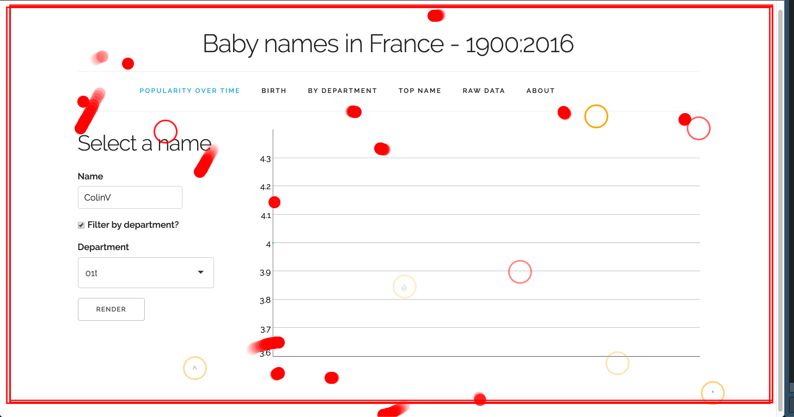
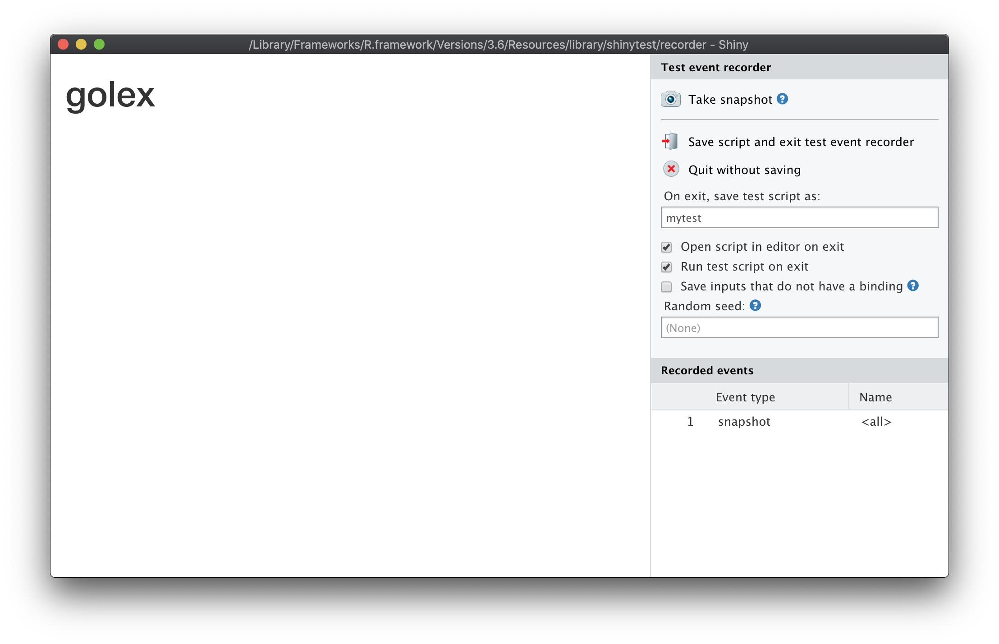
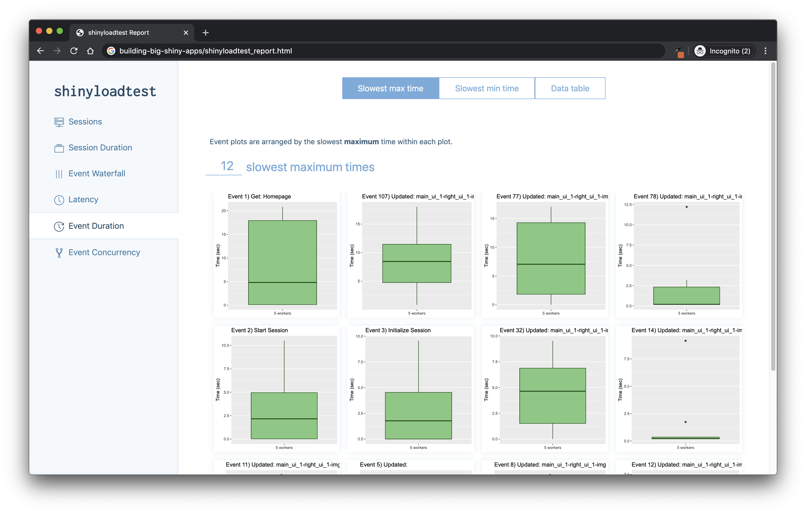
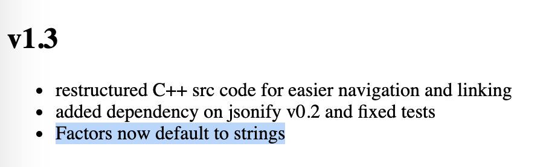

# (PART) Step 4: Strengthen {.unnumbered}

```{r 11-step-by-step-secure-1, include = FALSE}
try({
  system("docker kill hexmake")
  system("docker kill xmk2")
})
```

# Build yourself a safety net {#step-secure}

> "Don't fuck over Future You"\
> `r right_link('JD', 'https://twitter.com/CMastication')`

Strengthening your app means two things: testing, and locking the application environment.

## Testing your app

The process of getting your application production-ready implies that the application is tested.
With a robust testing suite, you will develop, maintain, and improve in a safe environment and ensure your project sustainability.
What will you be testing?
Both sides of the application: the business logic and the user interface.
And also, the application load, *i.e* how much time and memory is required when your application starts being used by a significant amount of users, be it from the user perspective (how long does it take to complete a full scenario) and from the server perspective (how much memory is needed for my app to run).

### Testing the business logic

If you have been following the good practices we have listed in previous chapters, your current application has at least these two properties:

-   The business-logic functions are separated from your interactive-logic functions.
-   Your application is inside a package.

On top of being a sane organization approach, **using this separation inside a package structure allows to leverage all the tooling that has been built for testing "standard" packages**.

R developers have been developing packages for a long time, and at the time of writing these lines (April 2020), more than 15,000 packages are available on CRAN.
To sustain these developments, a lot of tools have been created to secure the development process, and especially tools for creating unit tests for your package.

Unit tests are a general concept in software engineering that describes the process of writing a form of assessment to check the validity of your code.
A simplified explanation is that if you write a function called `meaning_of_life` that returns `42`, you will expect this function to always return `42`, and to be alerted if ever this value changes.
Using unit tests is a way to secure your work in the future, be it for future you, for your collaborator, or for anybody wanting to collaborate to the project: if anyone comes and change the code behind the `meaning_of_life()` function, and the result is no longer `42`, the developer working on this piece of code will be able to catch it.
The general idea is to detect bugs and breaking changes at the moment they are happening, not once it is too late.

There are several packages in R that can be used to implement unit testing, and you can even implement your own tests.
One of the most popular right now [^step-by-step-secure-1] is `{testthat}` [@R-testthat].
This testing framework lets you write a series of tests and expectations, which are then launched when calling `test()` from `{devtools}` [@R-devtools], either locally or in you CI system.

[^step-by-step-secure-1]: Based on the number of Reverse dependencies & suggests at <https://cran.r-project.org/web/packages/testthat/index.html>

Here is an example of testing that the `meaning_of_life` will always be `42`.

``` {.r}
# Creating a testing context, with one expectation
test_that("The meaning of life is 42", {
  expect_equal(
    meaning_of_life(), 
    42
  )
})
```

Once you have this test skeleton set, you will be able to detect any change to this function.

If you want to learn more about how to use `{testthat}`, you can refer to the following resources:

-   [`{testthat}` online documentation](https://testthat.r-lib.org/)

-   [Chapter 10 Testing - R Packages](https://r-pkgs.org/tests.html)

-   [Part 5: Test and Code Coverage - Building a package that lasts --- eRum 2018 workshop](https://speakerdeck.com/colinfay/building-a-package-that-lasts-erum-2018-workshop?slide=107)

### `shiny::testServer()`

At the time of writing these lines, the `{shiny}` team is actively working on a new way to test `{shiny}` server functions.
These features are still a work-in-progress, and are not available in the stable version of `{shiny}` we have used in this book (`r packageVersion("shiny")`).
Given that these features are still subject to change, we will not go into details about these new features, but here is a preview of what it will look like:

```{r 11-step-by-step-secure-2, eval = FALSE}
# Given the following module
computation_module_server <- function(input, output, session){
  ns <- session$ns
  r <- reactiveValues(
    value = NULL
  )
  observeEvent( input$selector , {
    r$value <- input$selector * 10
  })
  
}

# We can test it that way
library(shiny)
library(testthat)
testModule(computation_module_server, {

  # Give input$selector a value
  session$setInputs(selector = 1)
  # Call {testthat} functions
  expect_equal(r$value, 10)

  # Give input$selector a value
  session$setInputs(selector = 2)
  # Call {testthat} functions
  expect_equal(r$value, 20)


})
```

This methodology is still under-development, so we won't go deeper into this subject, but if you want to follow the update on this topic, please refer to the [Server function testing with Shiny](https://shiny.rstudio.com/articles/integration-testing.html) article on the `{shiny}` website.

### Testing the interactive logic

Once you have built a solid test suite for your business logic, another side of your app you might want to check is the interactive logic, i.e. the user interface.

There are several tools from the web development world that can be used to do exactly that: mimicking an interactive session where instead of deliberately clicking on the application interface, you let a program do it for you.

#### A. `puppeteer` {.unnumbered}

`puppeteer` is a NodeJS module that drives a Google Chrome headless session and mimic a session on the app.

And good news, there is a Google Chrome extension, called [Puppeteer Recorder](https://chrome.google.com/webstore/detail/puppeteer-recorder/djeegiggegleadkkbgopoonhjimgehda), that allows you to create, while visiting a webpage, the `pupepeteer` script to reproduce your visit.
Here is, for example, a very small javascript script for testing `{hexmake}` [@R-hexmake], generated by this extension.

``` {.javascript}
// Require the node module
const puppeteer = require('puppeteer');
(async () => {
// launch puppeteer and connect to the page
const browser = await puppeteer.launch()
const page = await browser.newPage()
await page.goto('http://localhost:2811/')

// We're waiting for a DOM element to be ready
await page.waitForSelector('.row > .col > \
    .rounded > details:nth-child(3) > summary')
    // Now it's ready, we can click on it
    await page.click('.row > .col > .rounded > \
    details:nth-child(3) > summary')
    
    // Now our test is over, we can close the connection
    await browser.close()
})()
```

Be aware though that this extension does not record everything, at least with the version used while writing this book (`0.7.1`).
For example, typing inside a text input is not recorded: that is completely doable inside `puppeteer`, yet not recorded by this extension [^step-by-step-secure-2] .

[^step-by-step-secure-2]: See [puppeteer/issues/441](https://github.com/puppeteer/puppeteer/issues/441) for the code to set the text input values.

Once you have this piece of code, put it into a NodeJS script, and replay the session as many time as you need.
If ever one of the steps can not be replayed as recorded, the script will fail, notifying you of a regression.

Several packages in R mimic what `puppeteer` does (Google Chrome headless orchestration), with notably `{crrri}` [@R-crrri] and `{chromote}` [@R-chromote].
These packages can be used to launch and manipulate a Google Chrome headless session, meaning that you can programmatically navigate and interact with a webpage from R.
And to do the tests in a `puppeteer` spirit, you can refer to the `{crrry}` package [@R-crrry], which contains a series of wrapper functions around `{crrri}`, specifically designed for `{shiny}`.

Here is an example:

```{r 11-step-by-step-secure-3, eval = FALSE}
# Creating a new test instance
test <- crrry::CrrryOnPage$new(
  # Using the `find_chrome()` function to guess where the 
  # Chrome bin is on our machine
  chrome_bin = pagedown::find_chrome(),
  # Launching Chrome on a random available port on our machine
  # Note that you will need httpuv >= 1.5.2 if you want to use 
  # this function
  chrome_port = httpuv::randomPort(), 
  # Specifying the page we want to connect to
  url = "https://connect.thinkr.fr/hexmake/",
  # Do everything on the terminal, with no window open
  headless = TRUE
)
```

    Running \
      '/Applications/Google Chrome.app/Contents/MacOS/Google Chrome' \
      --no-first-run --headless \
      '--user-data-dir=/Users/colin/Library/Application Support/
        r-crrri/chrome-data-dir-dhutmfux' \
      '--remote-debugging-port=40698'

```{r 11-step-by-step-secure-4, eval = FALSE}
# We'll wait for the application to be ready to accept inputs
test$wait_for_shiny_ready()
```

    Shiny is computing
    ✓ Shiny is still running

You can then call one of the `test` object methods:

-   `call_js()`, that allows you to run JavaScript code
-   `shiny_set_input()` changes the value of a `{shiny}` Input
-   `wait_for()` waits for a JavaScript condition to be TRUE
-   `click_on_id` clicks on a given id

Of course, the interesting part is doing "bulk testing" of your application, for example by setting a series of values to an input:

```{r 11-step-by-step-secure-5, eval = FALSE}
for (i in letters[1:5]){
  # We'll be setting a series of letters, one by one
  # for the package name input
  test$shiny_set_input(
    "main_ui_1-left_ui_1-pkg_name_ui_1-package", 
    i
  )
}
```

    -- Setting id main_ui_1-left_ui_1-pkg_name_ui_1-package--
    Shiny is computing
    ✓ Shiny is still running
    -- Setting id main_ui_1-left_ui_1-pkg_name_ui_1-package --
    Shiny is computing
    ✓ Shiny is still running
    -- Setting id main_ui_1-left_ui_1-pkg_name_ui_1-package --
    Shiny is computing
    ✓ Shiny is still running
    -- Setting id main_ui_1-left_ui_1-pkg_name_ui_1-package --
    Shiny is computing
    ✓ Shiny is still running
    -- Setting id main_ui_1-left_ui_1-pkg_name_ui_1-package --
    Shiny is computing
    ✓ Shiny is still running

And once your test is done, do not forget to close the connection!

```{r 11-step-by-step-secure-6, eval = FALSE}
# Closing the connection
test$stop()
```

#### B. Monkey test {.unnumbered}

If you are working on a user-facing software (i.e a software used by external users), there is one rule to live by: every unexpected behavior that can happen, will happen.
In other words, if you develop and think "a user will never do that", just expect a user to eventually do "that".

But how can we get prepared for the unexpected?
How can we test the "crazy behavior" that user will adopt?
In web development, there exists a methodology called "Monkey testing", which consists of **launching a series of random event on a webpage: random text in input, scrolling, clicking, zooming... and see if the application crashes or not**.
This software testing method allows to test the robustness of the application, by seeing how much it can handle unexpected behaviors.

Several JavaScript libraries exist when it comes to monkey testing, one of the most popular (and easy to use) library is called [`gremlin.js`](https://github.com/marmelab/gremlins.js).
This library is particularly interesting when it comes to `{shiny}` as it does not need external installation: you can add the library as a bookmark on your browser, navigate to the application, and launch the testing (click on the "Generate Bookmarklet" link on the [top of the README]((https://github.com/marmelab/gremlins.js))).
Figure \@ref(fig:11-step-by-step-secure-6) show an example of running gremlins on the prenoms application.

(ref:gremlinscap) Example of using `gremlins.js` on the "prenoms" `{shiny}` application.

```{r 11-step-by-step-secure-7, echo=FALSE, fig.cap="(ref:gremlinscap)", out.width='100%'}

```

And if you want to scale this, you can also combine it with `{shinyloadtest}` [@R-shinyloadtest]: launch a session recording, run `gremlins` one or several time inside the recording, then replay it with multiple sessions.

With `{crrry}`, this `gremlins` test comes for free:

```{r 11-step-by-step-secure-8, eval = FALSE}
# Creating a new test instance
test <- crrry::CrrryOnPage$new(
  # Using the `find_chrome()` function to guess where the 
  # Chrome bin is on our machine
  chrome_bin = pagedown::find_chrome(),
  # Launching Chrome on a random available port on our machine
  # Note that you will need httpuv >= 1.5.2 if you want to use 
  # this function
  chrome_port = httpuv::randomPort(), 
  # Specifying the page we want to connect to
  url = "https://connect.thinkr.fr/hexmake/",
  # Do everything on the terminal, with no window open
  headless = TRUE
)
# We'll wait for the application to be ready to accept inputs
test$wait_for_shiny_ready()
# We launch the horde of gremlins
test$gremlins_horde()
# Sleep, let the gremlins do their job
Sys.sleep(10)
# Check that the app is still working
test$wait_for_shiny_ready()
# Stop the connection
test$stop()
```

#### C. `{shinytest}` {.unnumbered}

Finally, if you prefer a `{shiny}` specific package, you can go for `{shinytest}` [@R-shinytest].
This package, created and maintained by RStudio, **allows you to do a series of screenshots of your application, and then replays your app and compare the previously taken screenshots to the current state of your application**, allowing you to detect any changes in the interface.

If you are building your application with `{golem}` [@R-golem], you will need to add an `app.R` file at the root of your package, then run `shinytest::recordTest()`:

```{r 11-step-by-step-secure-9, eval = FALSE}
# Create an app.R file at the root of the package
golem::add_rstudioconnect_file()
# Launch a test, and record a series of 
# snapshots of your application
shinytest::recordTest()
```

Once this function is run, a new window opens: it contains your app, and a "Screenshot" button on the right.
Using this button, you can take various recording of your shiny application at different states, as show in figure \@ref(fig:11-step-by-step-secure-9).

(ref:shinytestcap) General view of a `{shinytest}` window.

```{r 11-step-by-step-secure-10, echo=FALSE, fig.cap="(ref:shinytestcap)", out.width='100%'}

```

Then, you can do some changes in your app, and run:

```{r 11-step-by-step-secure-11, eval = FALSE}
shinytest::testApp()
```

If the `{shinytest}` package detects a visual change in the application, you will be immediately alerted, with a report of the difference from the snapshots you took and the current state of the application.

### Testing the app load

```{r 11-step-by-step-secure-12, include=FALSE, error=TRUE, eval = TRUE}
try({system("docker rm hexmake")})
```

#### A. `{shinyloadtest}` {.unnumbered}

`{shinyloadtest}` [@R-shinyloadtest] **tests how an application behaves when one, two, three, twenty, one hundred users connect to the app and use it**, and gives you a visual report about the connection and response time of each session.
The idea with `{shinyloadtest}` is to first record a session where you mimic a user behavior, then `shinycannon`, a command line tool coming with `{shinyloadtest}`, replays the recording several times.
Once the session has been replayed several times mimicking the session you have recorded, you have access to a report of the behavior of your app.

```{r 11-step-by-step-secure-13 }
library(shinyloadtest)
```

```{r 11-step-by-step-secure-14, eval = FALSE}
# Starting your app in another process
p <- processx::process$new(
  "Rscript", 
  c( "-e",  "options('shiny.port'= 2811);hexmake::run_app()" )
)
# We wait for the app to be ready
Sys.sleep(5) 
# Check that the process is alive
p$is_alive()
# Open the app in our browser just to be sure
browseURL("http:://localhost:2811")
```

Record the tests, potentially in a new dir:

```{r 11-step-by-step-secure-15, eval = FALSE}
# Creating a directory to receive the logs
fs::dir_create("shinylogs")
# Performing the session recording inside this new folder
withr::with_dir(
  "shinylogs", {
    # Launch the recording of an app session, using port 1234
    shinyloadtest::record_session(
      "http://localhost:2811", 
      port = 1234
    ) 
  }
)
```

We now have a series of one or more recording/s inside the `shinylogs/` folder:

Then, let's switch to our command line, and rerun the session with `shinycannon`.
The `shinycannon` command line tools take several arguments: the path the `.log` file, the URL of the app, `--workers` specify the number of concurrent connections to run, and the `--output-dir` argument specifies where the report should be written.

Then, go to your terminal and run:

```{bash 11-step-by-step-secure-16, eval = FALSE}
shinycannon shinylogs/recording.log \
  http://localhost:2811 --workers 10 \
  --output-dir shinylogs/run1
```

And now, we have new files inside the folder, corresponding to the session recordings.

```{r 11-step-by-step-secure-17, eval = FALSE}
# printing the structure of shinylogs
fs::dir_tree("shinylogs", recurse = FALSE)
```

```{r 11-step-by-step-secure-18, echo = FALSE}
fs::dir_tree("shinylogs", recurse = FALSE, regexp  = "csv$", invert = TRUE)
```

Good news: we do not have to manually analyze these files---`{shinyloadtest}` offers a series of wrapper functions to do that.

```{r 11-step-by-step-secure-19, message = FALSE, warning = FALSE}
# Bringing the runs in the R session
shinyload_runs <- load_runs(
  "5 workers" = "shinylogs/run1"
)
```

We now have a data.frame that looks like this:

```{r 11-step-by-step-secure-20 }
dplyr::glimpse(head(shinyload_runs))
```

Then, `{shinyloadtest}` comes with a series of plotting functions that can be used to analyze your recording.
For example:

-   `slt_session_duration()` plots the session duration, with the various types of event that takes computation time: JS and CSS load, R computation...

(ref:sessionduration) Session duration

```{r 11-step-by-step-secure-21, fig.cap="(ref:sessionduration)", out.width="100%"}
slt_session_duration(shinyload_runs)
```

<!-- + `slt_waterfall()` plots the waterfall graph of session durations, ordered by events.  -->

<!-- (ref:waterfall) Waterfall graph of session durations -->

<!-- ```{r 12-step-by-step-secure-20, fig.cap="(ref:waterfall)", out.width="100%", out.height="100%"} -->

<!-- slt_waterfall(shinyload_runs) -->

<!-- ``` -->

And if you need to bundle everything into an HTML reports, `shinyloadtest_report()` is what you are looking for.

```{r 11-step-by-step-secure-22, eval = FALSE}
# Generating the report
shinyloadtest_report(shinyload_runs)
```

This function will generate an HTML report of all the things computed by `{shinyloadtest}`, as show in figure \@ref(fig:11-step-by-step-secure-22).

(ref:shinyloadtestreport) Webpage generated by `shinyloadtest_report()`

```{r 11-step-by-step-secure-23, echo=FALSE, fig.cap="(ref:shinyloadtestreport)", out.width="100%"}

```

To sum up with a step by step guide:

-   If the shiny app is only available on your machine, launch a process with `{processx}` [@R-processx], or in another R session, that launches the application.
    You can either set the port with `options('shiny.port'= 2811)`, or let shiny decide for you.
    Be sure that the process is running.
    If the app is online, use the online url (and make sure you have access to the app).

-   Run `shinyloadtest::record_session(url)`.
    You should probably set a different port for `{shinyloadtest}`, so that it does not try to connect on port 80.

-   Play around with your app, record a scenario of usage

-   Close the tab where the app is running.

-   Return to your terminal, and run the `shinycannon` command line tool

-   Wait for the process to be finished

-   Go back to R, and then you can analyse the data from the recordings, either manually or by generating the html report

#### B. `{shinyloadtest}`, `{crrry}`, and `{dockerstats}` {.unnumbered}

Another thing you might want to monitor is the memory/CPU usage of your application, which `{shinyloadtest}` does not natively provide: the package records the load from the browser point of view, not from the server one.
That's where `{dockerstats}` [@R-dockerstats] can come into play: this package is a wrapper around the command line `docker stats`, and returns an R data.frame with the stats.

You can get the `{dockerstats}` package from GitHub with:

```{r 11-step-by-step-secure-24, eval = FALSE}
remotes::install_github("ColinFay/dockerstats")
```

Or from npm via:

``` {.bash}
npm install -g r-dockerstats
```

```{r 11-step-by-step-secure-25 }
library(dockerstats)
```

With these stats, we can monitor the load on the app when it is run in a docker container.

We will start by launching the container using a `system()` call: here, we are running the `{hexmake}` application, bundled in the `colinfay/hexmake` docker image, on port 2811.
We also make sure we give it a name with `--name`, so that we can call it in our `dockerstats()` call later on.

```{r 11-step-by-step-secure-26, echo = FALSE, error = TRUE, eval = TRUE, cache=TRUE}
try({system("docker rm hexmake")})
system("docker run --name hexmake --rm -p 2811:80 colinfay/hexmake", wait = FALSE)
Sys.sleep(5)
```

```{r 11-step-by-step-secure-27, eval = FALSE}
# We are launching the docker container 
# using R system() command. Here, we are 
# running the container image called 
# colinfay/hexmake. We are naming the 
# container hexmake using the --name flag, 
# --rm means the container will be removed 
# when stopped, and finally the -p flag defines 
# how to bind the ports of the container
# with the ports of the host (left is the host,
#  right is the container): in other word, here, 
#  we bind port 80 of our container to the port 2811
# of our machine.
system(
  "docker run --name hexmake --rm -p 2811:80 colinfay/hexmake", 
  wait = FALSE
)
```

Let's say now we want the stats for the hexmake container:

```{r 11-step-by-step-secure-28, eval = TRUE, cache=TRUE}
# Waiting for the container to be ready 
Sys.sleep(30)
# Showing the docker stats for hexmake
dockerstats("hexmake") %>% 
  tibble::as_tibble()
```

Of course, right now nobody is using the app, so the usage can be pretty small.
But let's push it a little bit by mimicking a lot of connections.

To do that, we can replay our `shinycannon` call, with at the same time using the `dockerstats_recurse()` function, that will recursively call `dockerstats()` on a regular interval.

```{bash 11-step-by-step-secure-29, eval = FALSE}
# Replaying the recording
shinycannon shinylogs/recording.log \ 
# Specificying the host url and the number of "visitors"
  http://localhost:2811 --workers 10 \
# Define where the recording will be outputed
  --output-dir shinylogs/run3
```

Let's launch at the same time a `dockerstats_recurse()` For example, here, we will print, on each loop, the `MemUsage` of the container, then saving the data inside a `dockerstats.csv` file.

```{r 11-step-by-step-secure-30, eval = FALSE}
# Calling recursive the dockerstats function. 
# The callback function takes a function, and define
# what to do with the data.frame each time the 
# dockerstats results are computed.
dockerstats_recurse(
  "hexmake",
  # append_csv is a {dockerstats} function that will 
  # apped the output to a given csv
  callback = append_csv(
    file = "shinylogs/dockerstats.csv", 
    print = TRUE
  )
)
```

Figure \@ref(fig:11-step-by-step-secure-30) is what both these processes look side to side.

(ref:dockerstatscap) `{dockerstats}` and `shinycannon` running side-by-side at the same time.

```{r 11-step-by-step-secure-31, echo=FALSE, fig.cap='(ref:dockerstatscap)', out.width='100%'}
knitr::include_graphics("img/hexmake-dockerstats.png")
```

As you can see, as the number of connections grow, the memory usage grows.
And we now have a csv with the evolution of the `docker stats` records over time!

```{r 11-step-by-step-secure-32 }
# read_appended_csv() allows to read a csv that has been 
# constructed with the append_csv() function
docker_stats <- read_appended_csv(
  "shinylogs/dockerstats.csv"
)
```

```{r 11-step-by-step-secure-33 }
dplyr::glimpse(head(docker_stats))
```

```{r 11-step-by-step-secure-34, include=FALSE, eval = TRUE, cache=TRUE}
try({system("docker kill hexmake")})
```

If you need a deeper look into the connection between application actions and the docker stats, you can also combine `{dockerstats}` with `{crrry}`, the idea being that you can record the CPU usage at the exact moment the application performs a specific computation.

Let's record the computation of the `hexmake` container containing the same app as before.

First, launch the container:

```{r 11-step-by-step-secure-35 }
# Launching the container a second time, 
# but name it xmk2 and serve it on port 2708
system(
  "docker run -p 2708:80 --rm --name xmk2 -d colinfay/hexmake", 
  wait = FALSE
)
Sys.sleep(60) # Let the container launch
```

Then, a `{crrry}` job:

```{r 11-step-by-step-secure-36, eval = FALSE, echo = TRUE}
# See previous version of this code for a commented explanation 
test <- crrry::CrrryOnPage$new(
  chrome_bin = pagedown::find_chrome(),
  chrome_port = httpuv::randomPort(),
  url ="http://localhost:2708",
  headless = TRUE
)
```

    Running '/Applications/Google 
      Chrome.app/Contents/MacOS/Google Chrome' 
      --no-first-run --headless \
      '--user-data-dir=/Users/colin/Library/Application     
      Support/r-crrri/chrome-data-dir-thyhpptv' \
      '--remote-debugging-port=48938'

```{r 11-step-by-step-secure-37, eval = FALSE}
test$wait_for_shiny_ready()
```

    Shiny is computing
    ✓ Shiny is still running

```{r 11-step-by-step-secure-38, eval = FALSE, include = FALSE, results = 'hide'}
# See previous version of this code for a commented explanation 
test <- crrry::CrrryOnPage$new(
  chrome_bin = pagedown::find_chrome(),
  chrome_port = httpuv::randomPort(),
  url ="http://localhost:2708",
  headless = TRUE
)
test$wait_for_shiny_ready()
```

```{r 11-step-by-step-secure-39, eval = FALSE, include=FALSE}
# We are creating a first data.frame that records the launch 
# of the container.
results <- dockerstats::dockerstats("xmk2", extra = "launch")

for (i in letters[1:10]){
  # We will be setting a letter for the package name input
  test$shiny_set_input(
    "main_ui_1-left_ui_1-pkg_name_ui_1-package", 
    i
  )
  # Once the input is set, we call dockerstats() for this container
  # and bind the results to the previously created data.frame
  results <- rbind(
    results, 
    dockerstats::dockerstats("xmk2", extra = i)
  )
}

# Stopping the docker container
system("docker kill xmk2")

# Stopping the tests
test$stop()
```

```{r 11-step-by-step-secure-40, eval = FALSE}
# We are creating a first data.frame that records the launch 
# of the container.
results <- dockerstats::dockerstats("xmk2", extra = "launch")

for (i in letters[1:10]){
  # We will be setting a letter for the package name input
  test$shiny_set_input(
    "main_ui_1-left_ui_1-pkg_name_ui_1-package", 
    i
  )
  # Once the input is set, we call dockerstats() 
  # for this container and bind the results to 
  # the previously created data.frame
  results <- rbind(
    results, 
    dockerstats::dockerstats("xmk2", extra = i)
  )
}
```

    -- Setting id main_ui_1-left_ui_1-pkg_name_ui_1-package --
    Shiny is computing
    ✓ Shiny is still running
    -- Setting id main_ui_1-left_ui_1-pkg_name_ui_1-package --
    Shiny is computing
    ✓ Shiny is still running
    -- Setting id main_ui_1-left_ui_1-pkg_name_ui_1-package --
    Shiny is computing
    ✓ Shiny is still running
    -- Setting id main_ui_1-left_ui_1-pkg_name_ui_1-package --
    Shiny is computing
    ✓ Shiny is still running
    -- Setting id main_ui_1-left_ui_1-pkg_name_ui_1-package --
    Shiny is computing
    ✓ Shiny is still running
    -- Setting id main_ui_1-left_ui_1-pkg_name_ui_1-package --
    Shiny is computing
    ✓ Shiny is still running
    -- Setting id main_ui_1-left_ui_1-pkg_name_ui_1-package --
    Shiny is computing
    ✓ Shiny is still running
    -- Setting id main_ui_1-left_ui_1-pkg_name_ui_1-package --
    Shiny is computing
    ✓ Shiny is still running
    -- Setting id main_ui_1-left_ui_1-pkg_name_ui_1-package --
    Shiny is computing
    ✓ Shiny is still running
    -- Setting id main_ui_1-left_ui_1-pkg_name_ui_1-package --
    Shiny is computing
    ✓ Shiny is still running

```{r 11-step-by-step-secure-41, eval = TRUE, include=FALSE}
try({
  # Stopping the docker container
  system("docker kill xmk2")
  
  # Stopping the tests
  test$stop()
})

```

And draw a small graph of this evolution:

```{r 11-step-by-step-secure-42, echo = FALSE}
results <- readRDS("dataset/results.RDS")
```

(ref:dockerstatsusage) Plot of the `{dockerstats}` evolution

```{r 11-step-by-step-secure-43, fig.cap="(ref:dockerstatsusage)", eval = TRUE, cache=TRUE}
library(dplyr, warn.conflicts = FALSE)
# We are converting the MemUsage and record_time columns 
# to a format that can be used in {ggplot2}
results <- results %>% 
  mutate(
    MemUsage = to_mib(MemUsage), 
    record_time = as.POSIXct(record_time)
  )
library(ggplot2)
# Using the record time as an x axis, 
# then adding the MemUsage as a line (to watch the 
# evolution over time), then we add the 'extra' column, 
# that contains the letters, as vertical lines + as 
# label
ggplot(
  data = results, 
  aes(x = record_time)
) + 
  geom_line(
    aes(y = MemUsage)
  ) + 
  geom_vline(
    aes(xintercept = record_time)
  ) + 
  geom_label(
    aes(
      y = max(MemUsage), 
      label = extra
    )
  ) + 
  labs(
    title = "MemUsage of 10 inputs for package name"
  )
```

## A reproducible environment

One of the challenges of building an app that needs to be sent to production is that you will need to work in a reproducible environment.
What does this mean?
**When building a production application, you are building a piece of software that will be launched on another computer, be it a server in the cloud or someone else's computer**.
Once your app is built, there are few chances that you will launch it on your own computer and that external users will connect to your computer.
What will happen is that you will either give your users a package (which will be the simplest way to share it: bundle the packaged app to a `tar.gz`, then let people install it either manually or from a package repository), or a URL where they can connect and use your app.

If you follow the `{golem}` workflow and all the good practices for a solid package, the application you have built should be deployable on another computer that has R.
In that second case, **you will have to think about how you can create your app in a reproducible environment**: in other words, be sure that the app is deployed under the same configuration as your local application---R version, package versions, system requirements, environment variables...

To help you achieve that, we will introduce two tools in the next section: `{renv}` [@R-renv], and [Docker](https://www.docker.com/).

### `{renv}`

#### A. About `{renv}` {.unnumbered}

How do we make sure the package versions we have installed on our machine stays the same in the production environment?
And also, how can we be sure that, working as a team, we will be able to work together using the same package versions?

From one package version to another, functions and behaviors change.
Most of the time, new version means new functions, and new features.
But from time to time, a new version means breaking change**s. Monitoring these changes and how they potentially break our code is an hard task: be it because checking versions of packages on various machines can take time**, or because debugging these bugs in your application logs is not straightforward.
And of course, the moment when we discover the error might not be the perfect time for us, as we might not have enough free time on our calendar to debug the application which has stopped running...

Let's take for example this traceback from the logs of an application we sent one day on a Shiny Server:

``` {.bash}
root@westeros-vm:/var/log/shiny-server# cat thewall(...).log
*** caught segfault ***
[...]
address 0x5100004d, cause 'memory not mapped'

Traceback:
1: rcpp_sf_to_geojson(sf, digits, factors_as_string)
2: sf_geojson.sf(data)
3: geojsonsf::sf_geojson(data)
4: addGlifyPolygons(., data = pol_V1, color = les_couleurs, 
popup = "val", opacity = 1)
5: function_list[[i]](value)
6: freduce(value, `_function_list`)
7: `_fseq`(`_lhs`)
8: eval(quote(`_fseq`(`_lhs`)), env, env)
[...]
105: captureStackTraces({
while (!.globals$stopped) {
..stacktracefloor..(serviceApp())
Sys.sleep(0.001)    }})
106: ..stacktraceoff..(captureStackTraces({
while (!.globals$stopped) {                
..stacktracefloor..(serviceApp())
Sys.sleep(0.001)    }}))
107: runApp(Sys.getenv("SHINY_APP"), 
port = port, 
launch.browser = FALSE)
An irrecoverable exception occurred. R is aborting now ...
```

Pretty hard to debug, isn't it?
What has actually happened?
On that specific case, it turned out that the package version from `{geojsonsf}` [@R-geojsonsf] was `1.2.1` on our development machine, and the one on the `{shiny}` server was updated to `1.3.0`, and there was a breaking change in the package, as shown in figure \@ref(fig:11-step-by-step-secure-38).
These kind of bugs are even harder to detect as `{geojsonsf}` was not a direct dependency of our app, but a dependency of one of our dependency, making it slightly more complex to identify.

(ref:geojsoncap) Breaking changes in `{geojsonsf}`, a dependency of a dependency of our `{shiny}` application.

```{r 11-step-by-step-secure-44, echo=FALSE, fig.cap='(ref:geojsoncap)', out.width='100%'}

```

The same thing could have happen if working as a team: one of the computer has an old version, when another one has updated to a more recent one.
How do we prevent that?
This is where the `{renv}` package comes into play: this package allows to have a project-based library, instead of a global one.
In other words, instead of having a library that is global to your machine, `{renv}` allows to specify packages with fixed versions for a project.
That means that you can have `{geojsonsf}` version `1.2.1` in one of your project, and the `1.3.0` in another, with the two not conflicting with each other.

#### B. Using `{renv}` {.unnumbered}

> Underlying the philosophy of renv is that any of your existing workflows should just work as they did befo.\
> `r right_link("Introduction to renv", "https://rstudio.github.io/renv/articles/renv.html")`

The first thing to do with `{renv}` is initiating it with the `init()` function.

```{r 11-step-by-step-secure-45, eval = FALSE}
# Loading and initiaing {renv}
library(renv)
init()
```

This function does several things:

-   Create/modify the `.Rprofile` file at the root of your project. Here is an example of what this files may look like inside an empty project:

```{r 11-step-by-step-secure-46, comment="", echo = FALSE}
readLines("data-raw/.Rprofile") %>%
  glue::as_glue()
```

In this example, there is just one call to a script, one located at `renv/activate.R`.

-   It creates a `renv.lock` file, which will list all the package dependencies

As we have initiated an empty project, we do not have any dependencies here.
If you run this command in a project that already has scripts and dependencies, `{renv}` will try to locate them all, and add them to this file.
Note that these packages may come from CRAN, Bioconductor, GitHub, GitLab, Bitbucket, and even local repositories.

The `renv/` folder contains a series of files that store your settings and the necessary packages, using a structure that mimics a local repository.

```{r 11-step-by-step-secure-47 }
# Displaying the structure of the folder
fs::dir_tree("data-raw/renvinit/", recurse = 5)
```

We will not go into details on this folder, as it is a rather complex structure and chances are that you will never have to update it by hand.

With `{renv}`, you can choose to link this "local repository" to a local cache, *i.e* a folder which is common to all your projects and stores packages and the different versions you already installed (this is the default behavior) or to store the complete packages inside the project, making it portable.

When you need a new package, you will have to install it in your local library.
The fastest way to install new packages in your `{renv}` powered project is by using the `install.packages` function, which is shimmed by `{renv}`.
This shim will search into the local cache to see if the package has already been cached, and if it is not, it will install and link it.

Now, we need to install a new package, for example `{attempt}` [@R-attempt]:

```{r 11-step-by-step-secure-48, eval = FALSE}
# Installing attempt
install.packages("attempt")
```

We will now add a little call to this library now:

```{r 11-step-by-step-secure-49 }
# Create a fake script that launches {attempt}
write("library(attempt)", "script.R")
```

Once you want to update your `{renv}` `Lockfile`, call `snapshot()`

```{r 11-step-by-step-secure-50, eval = FALSE}
# Snapshoting the current status of the environment
renv::snapshot(confirm = FALSE)
```

Note that if you are building an application as a package, use `renv::snapshot(type = "explicit")` (need version \> `0.9.3-99`): this will only capture the dependencies listed in the `DESCRIPTION` file.
If you don't specify this `type = "explicit"`, `{renv}` will go and look for all the package it can find in your file, and notably in your `.Rhistory`, meaning that if you one day used a function from `{dplyr}` but that your current package doesn't use it anymore, `{renv}` will include it.

```{r 11-step-by-step-secure-51, comment="", echo = FALSE}
readLines("data-raw/renv.lock") %>%
  glue::as_glue()
```

And now that you have a reproducible `{renv}` library, what is next?
Of course, if you are either working as a team or deploying to a server, you will have to restore the state of your project, which is now living somewhere else, inside your current project / deployment.
And to do that, the function to call is `renv::restore()`, which will update your local project with the dependencies listed inside your `Lockfile`.

To sum up, here are the step to follow:

-   Initiate the project with `renv::init()`
-   Install / remove packages
-   Take a `snapshot()` of the state of your project
-   `renv::restore()` the state of your project using `renv.lock`
-   Share `.Rprofile`, `renv.lock`, `renv/activate.R` and `renv/settings.dcf` files for reproducibility

Of course, `renv::restore()` comes with another superpower: time traveling!
If you decide to update a package in your project, and realize that this package makes the application crash (*e.g.* an update to `{geojsonsf}`), you can go back in time to a previous version of your library by calling the `restore()` function.

There are more things you can do with `{renv}`.
If you want to know more, we invite you to refer to the [official documentation](https://rstudio.github.io/renv).

### Docker

#### A. R, Docker, `{shiny}` {.unnumbered}

Docker is a program that allows to download, install, create, launch and stop multiple operating systems, called containers, on a machine, which will be called the host.
This host can be your local computer, or the server where you deploy your application/s.

Docker was designed for **enclosing software environments inside an image that can later be launched**.
The general idea is that with Docker, you are defining in a `Dockerfile` all the "rules" that are used to create a given environment, and then you can use this file (and the linked files, for example the R package containing your app) to **deploy your application on any given server that can run Docker**.
That way, if the `Dockerfile` can compile on your machine and if you can run it, it should work everywhere (of course, it is a little bit more complex than that, but you get the idea).

Why Docker in the context of `{shiny}` apps?
Because Docker allows you to abstract away the complexity of managing multiple versions of R and multiple version of the same package, or even different versions of the same system requirement.
For example, let's take our example with the breaking change in `{geojsonsf}` we used in the previous section.
With Docker, we can safely specify a `1.2.1` version in our image, and changing versions on the server would not have broken our code.

By using Docker for your deployment, you can build and deploy an application with the very same version of packages and R as the one on your computer.
And of course, you can change them without breaking the rest of the machine: everything that happens in a container stays in a container.
That way, if your are building your application with an older version of `{shiny}`, **you are sure that sending it to production will not break everything: the version inside the Docker is the same as the one from your machine**.
And later, if you update `{shiny}` and start a new project, you can deploy your app with another version of the package.
Same goes for your version of R.

#### B. Building a Dockerfile for your app {.unnumbered}

Good news!
If you are building your app with `{golem}`, the creation of the `Dockerfile` is just one function away!
If you have a look at the `03_deploy.R` file in the `dev` folder, you will find a series of functions that can create the `Dockerfile` for your project: either as a generic docker image, or for `{shiny}`Proxy or Heroku.

For example, to create a `Dockerfile` for a `{golem}` project, you can run, from the root of your package:

```{r 11-step-by-step-secure-52, eval=FALSE}
golem::add_dockerfile()
```

Let's take some time to understand this file, or and details how we could be building it from scratch.

1.  `FROM`

```{r 11-step-by-step-secure-53, echo = FALSE, comment=""}
# readLines("data-raw/Dockerfile")[1] %>% 
#   glue::as_glue()
cat("FROM", paste0(
    "rocker/r-ver:", 
    R.Version()$major,".", 
    R.Version()$minor
  ))
```

This line defines what version of R to use for deploying your application.
This `FROM` line is the one that sets an image to start from: you rarely (if ever) build a Docker image from nothing, but instead you use an existing image on top of which you build your own image.
Here, we choose one of the [r-ver](https://hub.docker.com/r/rocker/r-ver/) docker images, based on the output of:

```{r 11-step-by-step-secure-54, comment=""}
R.Version()$version.string
```

2.  `RUN`

The `RUN` calls in the file refers to bash calls that are used to build the image.
For example, the second line of the `Dockerfile` installs all the system requirements needed by our application.

    RUN apt-get update && \
    apt-get install -y  git-core \
    libcurl4-openssl-dev libssh2-1-dev \
    libssl-dev libxml2-dev make \
    zlib1g-dev && rm -rf /var/lib/apt/lists/*

In the subsequent `RUN` calls, `{golem}` chooses to call `remotes::install_version()` to be sure we install the version of the package that matches the one from your computer.

    RUN Rscript -e \
    'remotes::install_version("xfun",upgrade="never",version="0.19")'

As you can see, it matches the local version:

```{r 11-step-by-step-secure-55, comment="", eval = FALSE}
packageVersion("xfun")
```

    [1] ‘0.19’

3.  `ADD`

This Docker entry takes a folder or a file, and copies it inside the image.
With `{golem}`, we are adding the current project, containing the app, to a folder called `/build_zone`.

```{r 11-step-by-step-secure-56, echo = FALSE, comment=""}
readLines("data-raw/Dockerfile")[13] %>% 
  glue::as_glue()
```

4.  `EXPOSE`

This command defines which port of the container will be available from the outside of the container.

```{r 11-step-by-step-secure-57, echo = FALSE, comment=""}
readLines("data-raw/Dockerfile")[16] %>% 
  glue::as_glue()
```

5.  `CMD`

This final command is the one that is launched when you run a container.
With a `{shiny}` app, this command is the one that launches the application.

    CMD R -e \
     "options('shiny.port'=80,shiny.host='0.0.0.0');golex::run_app()"

#### C. `{dockerfiler}` {.unnumbered}

If you want to do everything from the R command line, the `{dockerfiler}` [@R-dockerfiler] package is here for you!
This package allows you to generate a `Dockerfile` straight from R:

```{r 11-step-by-step-secure-58 }
library(dockerfiler)
# Creating a new Dockerfile object
my_dock <- Dockerfile$new()
# Adding RUN, ADD, WORKDIR and EXPOSE commands
my_dock$RUN("apt-get update && apt-get install -y git-core")
my_dock$ADD(".", "/")
my_dock$RUN("mkdir /build_zone")
my_dock$ADD(".", "/build_zone")
my_dock$WORKDIR("/build_zone")
my_dock$RUN(r(remotes::install_local(upgrade="never")))
my_dock$EXPOSE(80)
# Viewing the Dockerfile
my_dock
```

#### D. Docker & `{renv}` {.unnumbered}

If you use `{renv}` to build your `{shiny}` application, it can also be used inside your Docker container.
To make those two tools work together, you will have to copy the files produced by `{renv}` inside the container: `.Rprofile`, `renv.lock`, `renv/activate.R` and `renv/settings.dcf` files.

Then run `renv::restore()` inside your application, instead of using the calls to `remotes::install_version()` as they are currently implemented when doing it with `{golem}`.

At the time of writing these lines, there is no native support of `{renv}` (with or without Docker) in `{golem}`, but that is something we can expect to happen in future versions of `{golem}`.

#### E. Develop inside a Docker container {.unnumbered}

Developers have their own R versions and operating systems, which generally differs from the one used on the production server, leading to issues when it comes to deploying the application.

If you plan on using Docker as a deployment mechanism, you can also use Docker as a local developer environment.
Thanks to the containers maintained by the [The Rocker Project](https://www.rocker-project.org/), it's possible to have a local environment that comes close to what you will find on the production server.
What's even more interesting is that this project offers images that can contain RStudio server: that means that the application that you will deploy in production can have the very same configuration as the one developers are using on their local machine: thanks to these containers, developers can work on a version of R that matches the one from the production server, using packages that will exactly match the one used in production.

Even more interesting is using RStudio inside Docker in combination with `{renv}`: the developers work on their machines, inside an IDE they know, and with system requirements (R versions, packages...) that can be reproduced on the production server!

#### F. Read more about Docker {.unnumbered}

-   [An Introduction to Docker for R Users](https://colinfay.me/docker-r-reproducibility/)

-   An Introduction to Rocker: Docker Containers for R [@RJ-2017-065]

-   The Rockerverse: Packages and Applications for Containerization with R [@rockerverse]
