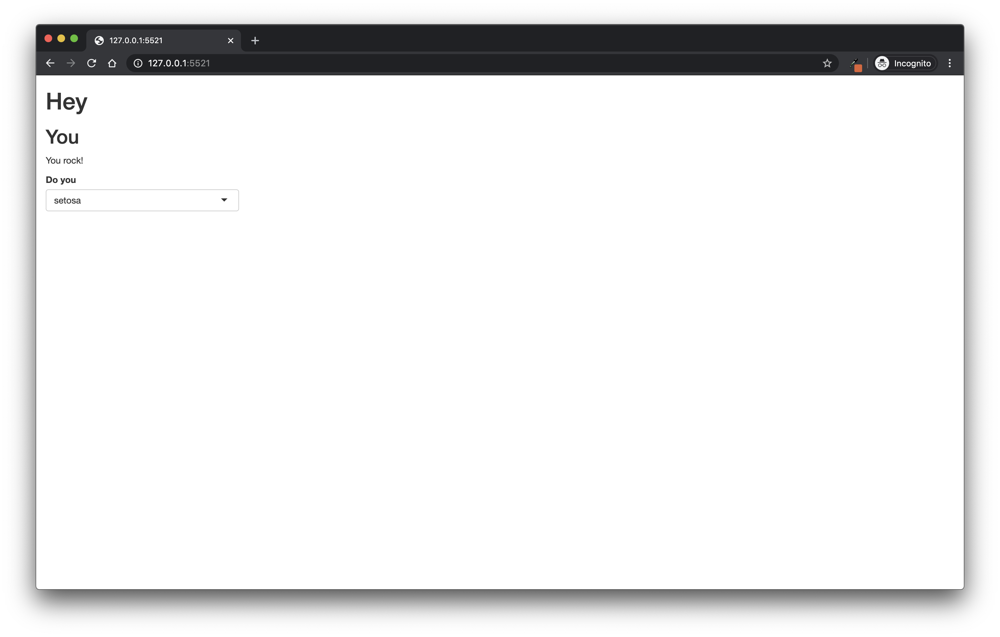
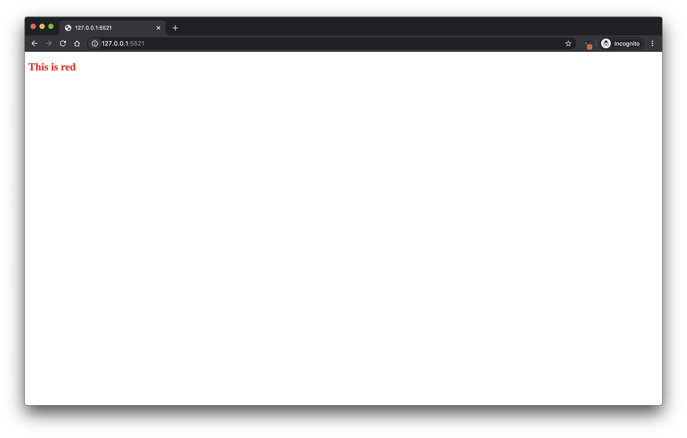

# A Gentle Introduction to CSS {#css}

## What is CSS

### About CSS

CSS, for `Cascading Style Sheets`, is one of the main technologies that powers the web today, along with HTML and JavaScript.
HTML is a series of tags that define your web page structure, and JavaScript is a programming language that allows you to manipulate the page (well, it can do a lot more than that, but we are simplifying to make it understandable).
**CSS is what handles the design, i.e. the visual rendering of the web page: the color of the header, the font, the background, and everything that makes a web page look like it is not from 1983** (again, we are simplifying for the sake of clarity).
In every browser, each HTML element has a default style: for example, all `<h1>` have the size `2em` and are in bold, and `<strong>` is in bold.
But we might not be happy with what a "standard page" (with no CSS) looks like: that is the very reason for CSS, modifying the visual rendering of the page.

If you want to get an idea of the importance of CSS, try installing extensions like [Web Developer](https://chrome.google.com/webstore/detail/web-developer/bfbameneiokkgbdmiekhjnmfkcnldhhm) for Google Chrome.
Then, if you go on the extension and choose CSS, click "Disable All Style", to see what a page without CSS looks like.

For example, Figure \@ref(fig:18-css-1) is what [rtask.thinkr.fr](https://rtask.thinkr.fr) looks like with CSS, and Figure \@ref(fig:18-css-2) and Figure \@ref(fig:18-css-3) shows what it looks like without CSS.

(ref:rtaskcss) <https://rtask.thinkr.fr> with CSS.

```{r 18-css-1, echo=FALSE, fig.cap="(ref:rtaskcss)", out.width="100%"}
knitr::include_graphics("img/rtask_with_css.png")
```

(ref:rtaskwithoutcss) <https://rtask.thinkr.fr> without CSS.

```{r 18-css-2, echo=FALSE, fig.cap="(ref:rtaskwithoutcss)", out.width="100%"}
knitr::include_graphics("img/rtask_without_css.png")
```

(ref:rtaskwithoutcss2) <https://rtask.thinkr.fr> without CSS.

```{r 18-css-3, echo=FALSE, fig.cap="(ref:rtaskwithoutcss2)", out.width="100%"}
knitr::include_graphics("img/rtask_without_css2.png")
```

CSS now seems pretty useful right?

### `{shiny}`'s default: `fluidPage()`

In `{shiny}`, there is a default CSS: the one from Bootstrap 3.
As you can see, if you have created a `fluidPage()` before, there is already styling applied.

Compare:

+ No `fluidPage`, Figure \@ref(fig:18-css-5)

```{r 18-css-4, eval = FALSE}
library(shiny)
ui <- function(){
  tagList(
    h1("Hey"), 
    h2("You"), 
    p("You rock!"), 
    selectInput("what", "Do you", unique(iris$Species))
  )
}

server <- function(
  input, 
  output, 
  session
){

}

shinyApp(ui, server)
```

(ref:nocssshiny) `{shiny}` without CSS.

```{r 18-css-5, echo=FALSE, fig.cap="(ref:nocssshiny)", out.width="100%"}

```

+ With `fluidPage`, Figure \@ref(fig:18-css-7)

```{r 18-css-6, eval = FALSE}
library(shiny)
ui <- function(){
  fluidPage(
    h1("Hey"), 
    h2("You"), 
    p("You rock!"), 
    selectInput("what", "Do you", unique(iris$Species))
  )
}

server <- function(
  input, 
  output, 
  session
){

}

shinyApp(ui, server)
```

(ref:cssshiny) `{shiny}` with its default CSS.

```{r 18-css-7, echo=FALSE, fig.cap="(ref:cssshiny)", out.width="100%"}

```

Yes, that is subtle, but you can see how it makes the difference on larger apps.

## Getting started with CSS

CSS is a descriptive language, meaning that you will have to declare the style either on a tag or inside an external file.
We will see how to integrate CSS inside your `{shiny}` application in the next section, but before that, let's start with a short introduction to CSS.[^css-1]

[^css-1]: Of course, this part will not make you an expert CSS programmer, but we hope you will get an idea of how it works, enough to get you started and want to learn more!

### About CSS syntax

CSS syntax is composed of two elements: a selector and a declaration block.
The CSS selector describes how to identify the HTML tags that will be affected by the style declared with key-value pairs in the declaration block that follows.
And because an example will be easier to understand, here is a simple CSS rule:

``` {.css}
h2 {
  color:red;
}
```

Here, the selector is `h2`, meaning that the HTML tags aimed by the style are the `<h2>` tags.
The declaration block contains the key-value pair telling that the `color` will be `red`.
Note that each key-value pair must end with a semicolon.

### CSS selectors

CSS selectors are a wide topic, as there are many combinations of things you might want to select inside an HTML page.

The first selector types are the "standard" ones: `name`, `id`, or `class`.
These refer to the elements composing an HTML tag: for example, with `<h2 id = "tileone" class = "standard">One</h2>`, the name is `h2`, the id is `tileone`, and the class is `standard`.[^css-2]

[^css-2]: Note that in HTML, id must be unique, but class must not.

To select these three elements in CSS:

-   Write the name as-is: `h2`.
-   Prefix the id with `#`: `#tileone`.
-   Prefix the class with `.`: `.standard`.

You can also combine these elements: for example, `h2.standard` will select all the `h2` tags with a class `standard`, and `h2,h3` will select `h2` and `h3`.

You can build more complex selectors: for example `div.standard > p` will select all the `<p>` tags that are contained inside a `div` of class `standard` (CSS combinator), or `a:hover`, which dictates the style of the `a` tags when they are hovered by the mouse (CSS pseudo-class), `div.standard::first-letter`, which selects the first letter of the `div` of class `standard` (CSS pseudo-elements), and `h2[data-value="hey"]`, which selects all the `h2` with a `data-value` attribute set to `"hey"` (CSS attribute selector).

As you can see, lots of complex selectors can be built with CSS, to target very specific elements of your UI.
But mastering these complex selectors is not the main goal of this chapter, hence we will just be using standard selectors in the rest of the examples in this book.

### CSS properties

Now that you have selected elements, it is time to apply some styles!
Between the brackets of the declaration block, you will have to define a series of key-value elements defining the properties of the style: the key here is the CSS property, followed by its value.

For example, `color: red;` or `text-align: center;` defines that for the selected HTML elements, the color will be red, or the text centered.
We will not cover all the possible properties, as there are hundreds of them.
Feel free to refer to the [CSS Reference](https://developer.mozilla.org/en-US/docs/Web/CSS/Reference) page from Mozilla for an exhaustive list of available properties.

## Integrate CSS files in your `{shiny}` app

Now that you have an idea of how to start writing your own CSS, how do you integrate it into your `{shiny}` application?
There are three methods that can be used: writing it inline, integrating it inside a `tags$script()` straight into your application UI code, or by writing it into an external file.
Note that good practice is considered to be the integration of an external file.

### Inline CSS

If you need to add style to one specific element, you can write it straight inside the HTML tag, as seen in Figure \@ref(fig:18-css-9):

```{r 18-css-8, eval = FALSE }
library(shiny)
ui <- function(){
  tagList(
    h2(style = "color:red;", "This is red")
  )
}

server <- function(
  input, 
  output, 
  session
){

}

shinyApp(ui, server)
```

(ref:cssshinyred) `{shiny}` with a red title.

```{r 18-css-9, echo=FALSE, fig.cap="(ref:cssshinyred)", out.width="100%"}

```

But this method loses all the advantages of CSS, notably, the possibility of applying style to multiple elements.
Use it with caution.

### Writing in a `tags$style()`

If you had a `tags$style()` somewhere inside your UI code (generally at the very beginning of your UI), you could then add CSS code straight to your application.

Figure \@ref(fig:18-css-11) is an example:

```{r 18-css-10, eval = FALSE}
library(shiny)
ui <- function(){
  tagList(
    tags$style(
      "h2{
        color:red;
      }"
    ), 
    h2("This is red")
  )
}

server <- function(
  input, 
  output, 
  session
){

}

shinyApp(ui, server)
```

(ref:cssshinyred2) `{shiny}` with a red title.

```{r 18-css-11, echo=FALSE, fig.cap="(ref:cssshinyred2)", out.width="100%"}

```

This works, but should not be considered as the best option: indeed, if you have a large amount of CSS code to insert in your app, it can make the code harder to read as it adds a large amount of visual noise.

The best solution, then, is to go with the alternative of writing the CSS inside a separate file: it allows you to separate things and to make the UI code smaller, as it is easier to maintain a separate CSS file than a CSS written straight into R code.

### Including external files

To include an external CSS file, you will have to use another tag: `tags$link()`.
What this tag will contain is these three elements:

-   `rel="stylesheet"`
-   `type="text/css"`
-   `href="www/custom.css"`

The first two are standard: you do not need to change them; they are necessary to indicate to the HTML page that you are creating a stylesheet, with the type being text/css.
The `href` is the one you will need to change: this path points to where your style file is located.

If you are building your application with `{golem}` [@R-golem], the good news is that this file creation and linking is transparent: if you call `golem::add_css_file("name")`, a file will be created at `inst/app/www`, and this file will be automatically linked inside your UI thanks to the `bundle_resources()` function.

### Using R packages

If you want to use an external CSS template, there are several packages that exist that can implement new custom UI designs for your application.
Here are some:

-   `{resume}`[@R-resume], provides an implementation of the [Bootstrap Resume Template](https://github.com/BlackrockDigital/startbootstrap-resume).

-   `{nessy}` [@R-nessy], a port of [NES CSS](https://github.com/nostalgic-css/NES.css).

-   `{skeleton}` [@R-skeleton], [Skeleton CSS](http://getskeleton.com/).

-   `{shinyMobile}` [@R-shinyMobile], shiny API for Framework7 (IOS/android).

-   `{shinydashboardPlus}` [@R-shinydashboardPlus], extensions for shinydashboard.

-   `{bs4Dash}` [@R-bs4Dash], Bootstrap 4 shinydashboard using AdminLTE3: an example is available at [engineering-shiny.org/bs4dashdemo/](https://engineering-shiny.org/bs4dashdemo/)

-   `{fullPage}`[@R-fullPage], fullPage.js, pagePiling.js, and multiScroll.js for shiny.

And all the amazing things done at [RinteRface](https://github.com/RinteRface).

## External resources

If you want to learn more about CSS, there are three places where you can get started:

-   [FreeCodeCamp](https://www.freecodecamp.org/learn), which contains many course hours covering HTML and CSS.

-   [W3 Schools CSS Tutorial](https://www.w3schools.com/css/)

-   [Learn to style HTML using CSS](https://developer.mozilla.org/en-US/docs/Learn/CSS)
