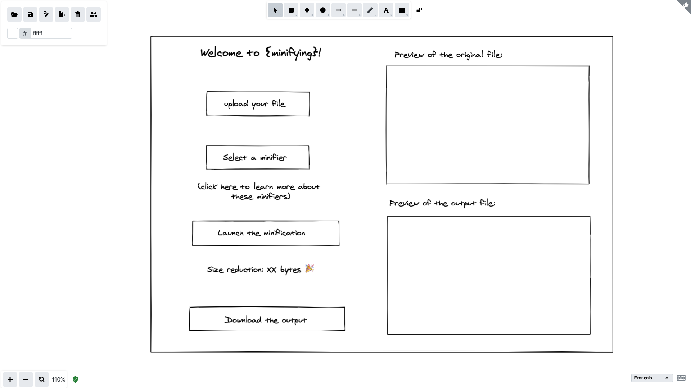

# (PART)  Appendix {-}

# Use case - Building an App, from Start to Finish (#usecase) {-}

This chapter aims at exemplifying the workflow developed in this book using a "real life" example. 
In this appendix, we will be building a `{shiny}` application from start to finish. 
We've chosen to built an application that doesn't rely on heavy computation/data analysis, so that we can focus on the engineering process, not on the internals of the analytic methology, nor on spending time explaining the dataset. 

## About the application {-}

In this appendix, we will build a "minify" application, an application that takes a CSS, JavaScript, HTML or JSON input, and output a minified version of this file. 
We will rely on the `{minifyr}` package to build this application

Here is for example what the specifications for this app could look like

``` txt
Hello! 

We want to build a small application that can minify CSS, JavaScript, HTML and JSON. 

In this app, user will be able either to paste the content or to upload a file. 

Once the content is pasted/upladed, they select the type, which is pre-selected based on the file extension. 
Then they click on a button, and the content is minified. 

They can then copy the output, or download it as a file. 

Cheers!
```

## Step 1: Design {-}

### Deciphering the Specifications {-}

#### General Observations {-}

+ As this app is pretty straightforward, it would be better to handle everything in the same page, _i.e_ everything should happen on the same page (no tab)

+ It would be a plus to have the "before minification" / "after minification" gain, so that the users have a better idea of the purpose of the application

#### User Experience Considerations {-}

+ We should provide a link to an explanation of what is minification

+ User might get different result based on what minifying algorithm they use, which can be surprising at first. 
The application should alert about this. 

+ For long printed outputs, if we use `verbatimTextOuput`, we should be careful about the page width, as these elements will natively overflow on the x-axis of the page. 
This should be doable with the following CSS: `pre{ white-space: pre-wrap; word-break: keep-all; }`

+ We should be careful about using semantic html for the inputs and output

#### Technical Points {-}

+ As `{minifyr}` wraps a NodeJS module, we will need to install NodeJS when deploying

+ To be sure that the process works, we should check the validity of the file extension from the UI and from the server side

### Building a Concept Map {-}

Here is the concept map for this application, using Xmind.

(ref:conceptmapminifyr) A concept map for the minifying application

```{r 19-appendix-1, echo=FALSE, fig.cap="(ref:conceptmapminifyr)", out.width="100%"}
knitr::include_graphics("img/minifyr-map.png")
```

### Asking Questions {-}

#### About the end users {-}

+ _Who are the end users of your app?_ 

This application is mainly useful for web-developers.

+ _Are they tech-literate?_ 

Yes.

+ _In which context will they be using your app?_ 

Notably at work, or while building pet projects.

+ _On what machines?_

Laptop/personal computer. 
Small chance of using this on a smartphone.

+ _What browser version will they be using?_

Hard to say, but given that we aim for a public of developers, probably modern browsers.

+ _Will they be using the app in their office, on their phone while driving a tractor, in a plant, while wearing lab coats?_ 

Nothing of the like: they should be using this application while developing, so chances are they are using it at a desk.

### Building personas {-}

Let's pick two random names for our personas, and two fake companies where they might be working at.

```{r 19-appendix-2, eval = TRUE}
nms <- withr::with_seed(
  608, {
    charlatan::ch_name(2)
    
  }
)
nms

company <- withr::with_seed(
  608, {
    charlatan::ch_company(2)
  }
)
company
```

#### `r nms[1]` - `{shiny}` developer at `r company[1]` {-}

`r nms[1]` is a `{shiny}` developer at `r company[1]`. 
She's been learning R at grade-school during her Master's Degree in statistics. 
When she started at `r company[1]`, she was mainly doing data analysis in Rmd, but has gradually switched to building `{shiny}` applications full-time. 
She discovered minification while reading the "Engineering Production-Grade Shiny App" book, and now want to add this to her `{shiny}`  application. 

#### `r nms[2]` - web developer and trainer at `r company[2]` {-}

`r nms[2]` is a web developer at `r company[2]`. 
He studied web development at the university, where he learned about minification. 
He is now also in charge of training new recruits for the company he works at, and also gives some lecture to the university he went to. 
Most of the minification he does is automated, but he is looking for a tool he can use during trainings and classes to explain how minification works.

## Step 2: Prototyping {-}

In this step, we will be building the back-end of the application on one side, and the UI on the other side. 
Once we have the back-end settled and the UI defined, we will be working on making the two work with each other. 

### Backend in Rmd {-}

Our back-end will be composed of two functions: 

```{r 19-appendix-3, echo = FALSE}
library(minifyr)
minif <- ls("package:minifyr", pattern = "minifyr_js_")
minif <- paste0("`", minif, "()`")
minif <- knitr::combine_words(paste0("`", minif, "()`"))
```


+ `guess_minifier`, which will take a function, and return the available algorithms for that file: for example, if you have a JavaScript file, you'll be able to use the `r minif` functions. 
If the type is not guessed based on the extension, the function should fail gracefully, and not make `{shiny}` crash. 
We'll chose to return an empty string if this extension is not guessed.

```{r 19-appendix-4}
library(minifyr)
guess_minifier <- function(file){
  # We'll start by getting the file extension
  ext <- tools::file_ext(file)
  # Check that the extension is correct, if not, return early
  # It's important to do this kind of check also on the server side 
  # As HTML manual tempering would allow to also send other type of files
  if (
    ! ext %in% c("js", "css", "html", "json")
  ){
    # Return early
    return(list())
  }
  # We'll then retrieve the available pattern based on the extension
  patt <- switch(
    ext, 
    js = "minifyr_js_.+",
    html = "minifyr_html_.+",
    css = "minifyr_css_.+",
    json = "minifyr_json_.+"
  )
  # List all the available functions to minify the file
  list(
    file = file,
    ext = ext,
    # We return this pattern so that it will be used to update the selectInput that 
    # is used to select an algo
    pattern = patt, 
    functions = grep(patt, names(loadNamespace("minifyr")), value = TRUE)
  )
  
}
# minifyr comes with a series of examples, so we can use them as tests
guess_minifier(
  minifyr_example("css")
)
guess_minifier(
  minifyr_example("js")
)
guess_minifier(
  minifyr_example("html")
)
guess_minifier(
  minifyr_example("json")
)
# Try with a non valid extension
guess_minifier(
  "path/to/text.docx"
)
```


+ A `compress()` function, which takes three parameters: the file as `input`, the `algo`, outputed from our last function, nd the selection, which is the one selected by the user. 
The compressed file will be outputed to a tempfile.

```{r 19-appendix-5}
compress <- function(algo, selection){
  # Creating a tempfile using our algo object
  tps <- tempfile(fileext = sprintf(".%s", algo$ext))
  # Getting the function with the selection
  converter <- get(
    grep(selection, algo$functions, value = TRUE)
  )
  # Do the conversion
  converter(algo$file, tps)
  # Return the temp file
  return(tps)
}

algo <- guess_minifier(
  minifyr_example("js")
)

compress(
  algo = algo, 
  selection = "babel"
)
```

+ Finally, a `compare()` function, that can compare the size of two files, so that we can measure the minification gain.
This function will take two file paths. 

```{r 19-appendix-6}
compare <- function(original, minified){
  # Get the file size of both
  original <- fs::file_info(original)$size
  minified <- fs::file_info(minified)$size
  return(original - minified)
}

```

So, for the complete process:

```{r 19-appendix-7}
algo <- guess_minifier(
  minifyr_example("js")
)

compressed <- compress(
  algo = algo, 
  selection = "babel"
)
compare(
  minifyr_example("js"), 
  compressed
)
```

Now, time to move this into a Vignette! 

### UI prototyping {-}

Let's start by drawing a small mock-up of our front-end using [Excalidraw](https://excalidraw.com/).

(ref:excalidraw) A mock-up for the UI of our application, made with Excalidraw (https://excalidraw.com/)

```{r 19-appendix-8, echo=FALSE, fig.cap="(ref:excalidraw)", out.width="100%"}

```

We would love this application to be "full screen", and to do that, we'll take inspiration from the [split-screen layout](https://www.w3schools.com/howto/howto_css_split_screen.asp) available at W3Schools. 
To mock the UI, we will also use the `{shinipsum}` package.

In this first step, we will start generating the module skeleton for the application. 
Here, we will have a `left` module for the left part of the app, and `right` for the right. 
Each will receive their corresponding `class`, based on the CSS from W3.
Now that these two spots are available, we'll add the two modules, with some fake output to simulate our application behavior. 
The left side will be functional, in the sense that uploading a file will randomly add algorithms to the `selectInput()`, and clicking on the `Launch the minification` will regenerate a fake text. 

Now, let's pick a soft palette of colors, using [coolors.co](https://coolors.co/palettes/), and a font family from [fonts.google.com](https://fonts.google.com/). 
We went for: 

+ One of the monochrome palette from [coolors.co](https://coolors.co/fbfbf2-e5e6e4-cfd2cd-a6a2a2-847577).
+ The `Sora` font [fonts.google.com/specimen/Sora](https://fonts.google.com/specimen/Sora).
There are not that much text displayed on the screen, so this font should work well.

We then used CSS to arrange our page: size, padding, alignment, colors...
If you want to know more about this file, it's located in the `inst/app/www` folder of the package.

## Step 3: Build {-}

Now we've got the backend in an Rmd, the front end working with `{shinipsum}`, now is the time to make the two work together!

Here is the logic we will be adding to the application: 

+ When a file is uploaded, we also check the format from the server-side: UI only restriction using `accept` will not be enough to stop users who __really__ want to upload something else.

+ If the file comes with the right extension, we update the algorithm selection, and read it inside the "Original content" block.

+ Once the user clicks on "Launch the minification", we create a temp file, and minify the original file inside this temp file. 

+ When the file is minified, we update the gain output to reflect how many bytes have been gained from the minification, and add the result of this minification to the "Minified content" block.

+ Finally, when the "Download the output" button is clicked, the minified file is downloaded. 

During this process, we will migrate the functions from the Rmd to their own files, use external dependencies, and document our business logic functions. 
You can refer to the `dev/02_dev.R` file if you want to read the exact steps taken here.

## Step 4: Strengthen {-}

As of now, we have a working application. 
Time to strengthen it! 

Here are the few steps we will be working on: 

+ Turning our business logic into an R6 Class, so that we can build tests around it, and prevent the data structure from taking part into the interactivity mechanic.
This R6 class will generate an object at the very start of our app, and it will be passed into the modules.

+ As the minification process takes a couple of seconds, we will add a small progress bar so that the user know something is happening. 

+ As we will use R6, we will need to manually set the reactive context invalidation. 
To do so, we will use `triggers` from `{gargoyle}`. 

+ Chances are that the users will be testing several algorithms when using the application, and we don't want the minification process to happen another time when it is called on the same file and with the same algorithm, even more as the process involves calling an external Node process. 
To prevent that, we will be caching the function that does the computation.

+ Create an unseen input that will upload data, so that we can build an interactivity test using `{crrry}`. 
This input will look like this on the server:

```{r 19-appendix-9}
  observeEvent( input$testingtrigger , {
    
    if (golem::app_dev()){
      file$original_file <- minifyr::minifyr_example(ext = input$testingtext)
      file$guess_minifier()
      file$type <- input$upload$type
      file$minified_file <- NULL
      file$original_name <- input$upload$name
      gargoyle::trigger("uploaded")
    }
  
  })
```

We use this pattern so that we can combine it with a testing suite with `{crrry}`, using the following pattern:

```{r 19-appendix-10, eval = FALSE}
test <- crrry::CrrryProc$new(
  chrome_bin = pagedown::find_chrome(),
  # Process to launch locally
  fun = "options(golem.app.prod = FALSE);golem::document_and_reload();run_app()",
  # Note that you will need httpuv >= 1.5.2 for randomPort
  chrome_port = httpuv::randomPort(), 
  headless = FALSE
)

test$wait_for_shiny_ready()
ext <- c("css", "js", "json", "html")
for (i in 1:length(ext)){
  # Set the extension value
  test$shiny_set_input("left_ui_1-testingtext", ext[i])
  # Trigger the file to be read
  test$shiny_set_input("left_ui_1-testingtrigger", i)
  # Launch the minification
  test$shiny_set_input("left_ui_1-launch", i)
}

test$stop()
```

It's safer to wrap these tests between `if(interactive())`, as running the checks outside of your current session might not launch the app correctly, and launching external processes (the one running the app with Chrome) might fail when run non-interactively. 
And on top of that, running these inside you CI might cause some pain, and of course if will not work on CRAN checks.

We'll also be building "standard" function checks, which you can find in the `test/` folder.

## Step 5: Deploy {-}

As an example, we will deploy this app through three medium: as a package, on RStudio Connect, and with Docker. 

### Before deploy checklist {-}

+ [x] _`devtools::check()`, run from the command line, returns 0 errors, 0 warnings, 0 notes_

+ [x] _The current version number is valid, *i.e* if the current app is an update, the version number has been bumped_: it makes sense, before the first deployment, to keep a version number of `0.0.0.9000`, and increment this dev version whenever we implement changes or do test deployments. 
As we are doing here a "true" deployment, we bumped the version to `0.1.0`.

+ [x] _Everything is fully documented_: we have documented all the functions, even the internal, there is a Vignette that describe the business logic, and the README is filled

+ [x] _Test coverage is good, i.e you cover a sufficient amount of the code base, and these tests cover the core/strategic algorithms_

+ [x] _It's clear to everyone involved in the project who is the person to call if something goes wrong _

+ [x] _It's clear to everyone involved in the project what is the debugging process, how to communicate bugs to the developer team, and how long it will take to get changes fixed_: this project will be made open source, so the bug will have to be listed on the Github repo. 
To help that, we added a link to the GitHub repository on the application. 

+ [x] _(If relevant) The server it is deployed on has all the necessary software installed (Docker, Connect, `{shiny}` Server...) to make the application run_.

+ [x] _The server has all the system requirements needed (the system libraries), and if not, they are installed with the application (if it's dockerized)_:  NodeJS will need to be installed on the Docker and on the Server running RStudio Connect. 
A check is also added on top of `run_app()` for the availability of NodeJS on the system, especially for people installing it as a package.
This check will also check if `node-minify` has been installed, and if note, it will be installed.
This check might take some time to run, but it will only be performed the first time the app is launched. 

+ [x] _The application, if deployed on a server, will be deployed on a port which will be accessible by the users_: when building the Dockerfile using `{golem}`, the correct port is exposed (_i.e_ the app will run on port 80, which is also made available). 
For the other medium, the port will be automatically chosen, either by `{shiny}` or by Connect

+ [x] _(If relevant) The environment variables from the production server are managed inside the application_: not relevant

+ [x] _(If relevant) The app is launched on the correct port, or at least this port can be configured via an environment variable_: not relevant

+ [x] _(If relevant) The server where the app is deployed have access to the data sources (database, API...)_: not relevant

+ [x] _If the app records data, there are backups for these data_: not relevant

### Deploy as a tar.gz {-}

To share an application as a tar.gz, you can call `devtools::build()`, which will compile a `tar.gz` file inside the parent folder of your current application. 
You can then share this archive, and install it with `remotes::install_local("path/to/tar.gz")`.
Note that this can also be done with base R, but `{remotes}` offers a smarter way when it comes to manage dependencies of your archived package. 

This `tar.gz` can also be send to a package repository; be it the CRAN or any other package manager you might have in your company. 

### Deploy on RStudio Connect {-}

Once we are sure that the server running connect has NodeJS installed, and that we have installed the minify module with `minifyr::minifyr_npm_install()`, we can create the app.R using `golem::add_rstudioconnect_file()`, and then push to the Connect server. 

### Deploy with Docker {-}

To create the `Dockerfile`, we'll start by launching `golem::add_dockerfile()`. 
This function will compute the system requirements^[
Note that at the time of writing these lines, there is also an issue with the dependencies collected by the `sysreq` API, leading to an issue when attempting to compile the Dockerfile. Removing the installation of `libgit2-dev` solved the issue. 
]., and create a generic `Dockerfile` for your application. Once this is done, we will create/update the `.dockerignore` file at the root of the package, so that unwanted files are not bundled with our docker image. 

Inside our `Dockerfile`, we will also change the default repo to use "https://packagemanager.rstudio.com/all/latest", which proposes precompiled packages for our system, making the installation faster. 
We will also add an installation of NodeJS, which is needed by our application

Then, we can go to our terminal, and compile the image!

```bash
docker build -t minifying . 
```

Now we've got a working image! 
We can try it with:

```bash
docker run -p 2811:80 minifying
```

