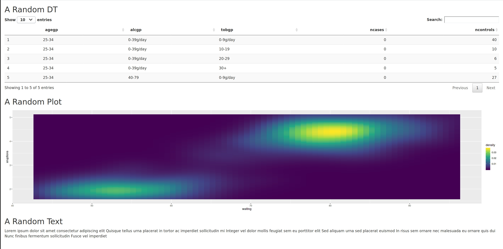

# Tools for prototyping {#proto}

Building the User Interface first should require the least possible calculations from the server part of your application. 
You focus on the appearance.  
The UI is usually a collection of buttons, figures and tables.
Some being triggered by others.
When first building your interface, you may only want to focus on where you place the different boxes and graphs.
You will use the different `*Input` from {shiny} for inputs that will later affect the server part.
You will also set the place for `*Output`, but these outputs will be empty.  
To show a first overview of what will look like your interface, you can use fake data and figures to fill the blank outputs.
This is where [{shinipsum}](https://thinkr-open.github.io/shinipsum/) and [{fakir}](https://thinkr-open.github.io/fakir/) come to help.  

## Fast prototyping with `{shinipsum}`

The goal of {shinipsum} is to provide random shiny elements to simulate interface outputs.
Use `lorem`, the long "Lorem Ipsum" text to fill in text parts.
Use the `random_*` functions in the `server` part of your application in combination with the appropriate `render*()`.
This will fill the corresponding call to `*Output()` in the `UI`.  
For instance:  

- `random_DT()` renders a `DT::datatable()` output with one of existing R internal datasets.  
- `random_ggplot(type = "point")` renders a random {ggplot2} graph with the selected `type` (corresponding to `geom()` in {ggplot2}).  
- `random_text(nwords = 10)` renders a text with the defined number of words.  

```r
library(shiny)
library(shinipsum)
library(DT)
ui <- fluidPage(
  h2("A Random DT"),
  DTOutput("data_table"),
  h2("A Random Plot"),
  plotOutput("plot"),
  h2("A Random Text"),
  tableOutput("text")
)

server <- function(input, output, session) {
  output$data_table <- DT::renderDT({
    random_DT(5, 5)
  })
  output$plot <- renderPlot({
    random_ggplot()
  })
  output$text <- renderText({
    random_text(nwords = 50)
  })
}
shinyApp(ui, server)
```
```{r, echo=FALSE, out.width="90%"}

```

Find out more in the corresponding website: https://thinkr-open.github.io/shinipsum/

## Using `{fakir}` for fake data generation

{fakir} was primarily created to provide fake datasets for R tutorials and exercises. 
"Fake support ticket dataset" is built using `fake_ticket_client()` and "Fake questionnaire on mean of transport / goal dataset" is built using `fake_sondage_answers()`.
They contain dates, numeric and character variables, with missing values allowing multiple exercises on data cleaning and graph building. 
They can also be joined with the included {sf} geographical dataset `fra_sf` allowing for maps creation.  
Fake datasets created with {fakir} can be used to build light examples on the use of the inputs, for filters or interactive maps for instance. 
When building your application inside a R package, as recommended in this book using {golem}, you may want to build small reproducible examples of your functions, to be presented in the vignettes and tested in the unit tests, prior to building the Shiny Apps itself. 
You can create these examples using {fakir}.  

Find out more in the corresponding website: https://thinkr-open.github.io/fakir/
